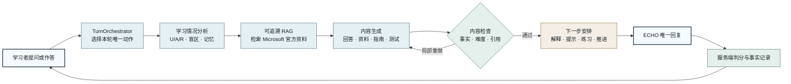
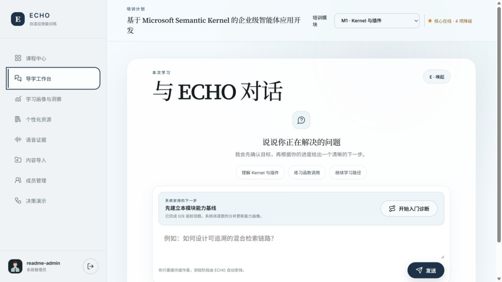
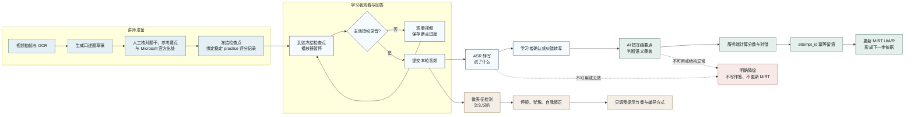

<div align="center">


# ECHO Adaptive Skill Training

**以对话为入口，把真实作答、官方证据、能力变化与下一步训练组织成一条可追溯的学习路径。**

[](https://github.com/Pitkil/echo-adaptive-skill-training/actions/workflows/ci.yml)


[产品全景](#产品全景) · [学习闭环](#学习闭环) · [语音链路](#语音链路) · [快速开始](#快速开始) · [Windows](#windows-docker) · [macOS](#macos-docker) · [开发文档](#开发文档)

</div>

## 产品全景

ECHO 是面向企业技能培训的多智能体学习系统。学习者始终只与一个 ECHO 对话；系统在后台读取作答和学习进度，检索 Microsoft 官方资料，生成并检查学习内容，再给出唯一的下一步。

当前竞赛版本聚焦 **“基于 Microsoft Semantic Kernel 的企业级智能体应用开发”**，包含三个连续模块：

| 模块 | 训练范围 | 目标产出 |
| --- | --- | --- |
| M1 · Kernel 与插件 | 模型服务、提示词、插件、函数调用 | 能调用插件的对话应用 |
| M2 · Agent 与多智能体协作 | Agent、线程状态、记忆、协作流程 | 有明确职责与状态传递的智能体流程 |
| M3 · 流程、部署与质量评测 | Process Framework、部署、安全、可观测、评测 | 可部署、可诊断、可验证的智能体应用 |

> 仓库的数据模型支持多个培训项目，但当前只有这一门课程具备正式目录。界面中的其他课程方向是扩展示例，不会产生虚假课时或进度。

### 设计原则

| 原则 | 系统约束 |
| --- | --- |
| 一个对话入口 | 后台 Agent 不伪装成多个面向学习者的聊天角色 |
| 一轮一个动作 | 判题、出题、资源生成和阶段推进不会在同一轮并发发生 |
| 证据优先 | 正式内容只引用 Microsoft Learn 与 `microsoft/semantic-kernel` 官方仓库或示例 |
| 能力与信号分层 | 只有可评分答案更新 U/A/R；语音微表征与长期记忆只调整诊断置信度和辅导方式 |
| 失败必须可见 | 外部服务不可用时记录降级原因，不伪造检索、记忆或检测结果 |

## 学习闭环



四个后台 Agent 分别保存输入、结果、失败原因和最终决定。PunditRAG 是知识检索与证据服务，不是第五个课程专家 Agent；SimpleMem 只保存跨会话语义记忆，不替代业务数据库。

## 核心能力

| 能力 | 已落地的行为 |
| --- | --- |
| ECHO 对话导学 | 保留 E/C/H/O 状态流转，根据当前模块与历史记录解释、追问、提示或迁移 |
| 固定测评闭环 | 前测、阶段测试、后测与练习按用途隔离；客户端只提交原始答案，服务端判分并防止重复计分 |
| MIRT 能力画像 | 按 M1/M2/M3 维护理解 U、应用 A、推理与评估 R，并输出能力趋势、证据盲区与学习路线 |
| 可追溯 RAG | 对接 PunditRAG 导入与查询双服务，保存知识库、文档、任务、章节、版本和官方链接 |
| 三类个性化资源 | 学习者可分别生成学习资料、实操指南或阶段练习；通过校验后可直接学习或下载。阶段练习仅供反馈，不替代固定题库的正式服务端测评 |
| 长期记忆 | 内置 SimpleMem 服务，支持组织与用户作用域、增删改查、合并、反馈闭环和异常降级 |
| 语音微表征 | 支持学习者授权录音与讲师批量录音；未确认说话人不进入个人画像，信号不直接修改 U/A/R |
| 语音转写与口述评分 | faster-whisper 转写后由学习者确认或纠错；冻结的视频检查点再由 AI 按讲师批准要点语义评分，服务端计算分数并幂等更新 MIRT |
| 视频伴学 | 上传课程视频、保存观看进度、生成并人工确认口述检查点；播放行为不会自动开启麦克风，未确认转写不会进入评分 |
| 多角色治理 | 学习者、讲师/导师、系统管理员三类权限；内容导入、成员管理与 Demo Trace 按角色显示 |
| 隐私删除 | 用户可发起幂等的数据删除请求，同步清理业务库、上传文件、SimpleMem 和用户自有 PunditRAG 文档 |
| 竞赛评测 | 冻结 50 组案例，校验真实运行结果并导出逐案失败原因与五项指标报告；正式运行与双人复核摘要见 [`docs/formal-evaluation-20260831.md`](docs/formal-evaluation-20260831.md) |

## 界面预览

<p align="center">
  
</p>

<p align="center"><sub>课程中心只把真实开放课程标记为可学习，并统一进入 ECHO 对话或视频伴学。</sub></p>

<p align="center">
  
</p>

<p align="center"><sub>导学工作台把自由对话与服务端安排的测评阶段放在同一入口；外部服务状态在顶部显式呈现。</sub></p>

## 用户路径

### 学习者

1. 从课程中心进入当前模块，或继续上次视频进度。
2. 在 ECHO 中提问、完成系统安排的前测、练习、阶段测试与后测。
3. 查看 U/A/R 能力变化、有作答依据的知识盲区和推荐路线。
4. 获取定制学习资料、实操指南和阶段测试。
5. 仅在主动授权后提交口述录音；视频检查点需核对转写后明确提交，评分结果进入 MIRT，微表征仍只辅助调整提示节奏。

### 讲师与管理员

1. 分别导入官方课程材料、固定题库与课程视频。
2. 在预览中核对题目答案、评分方法、用途、难度和官方出处后再确认入库。
3. 查看授权范围内的学习情况、语音任务、服务状态和后台决策记录。
4. 使用 Demo 模式展示“分析、检索、生成、检查、下一步安排”的完整闭环。

## 语音链路

### 视频伴学不止记录“看过”

传统视频平台通常只保存播放进度。ECHO 在讲师审核的学习节点暂停视频，让学习者用自己的话回答，
再把“答案内容”和“表达过程”拆成两条证据链：ASR 负责“说了什么”，微表征负责“怎么说的”。
两者并行处理但不混合计分，避免停顿、口音或犹豫被误当成专业能力不足。



### 这条链路的优势

| 优势 | ECHO 的实现方式 | 避免的问题 |
| --- | --- | --- |
| 学习证据更真实 | 到达课程内容对应的冻结检查点再口述回答，不用播放时长替代掌握程度 | “视频看完了”不等于“学会了” |
| 允许自然表达 | AI 按语义匹配讲师批准要点，同义表达无需逐字命中 | 关键词判分误伤正确答案 |
| 人机共同确认 | ASR 文本先由学习者核对或纠错，未经确认不能提交评分 | 专有名词识别错误污染能力画像 |
| 计分权留在服务端 | AI 只返回匹配要点编号；覆盖分数、通过结论和 MIRT 更新由程序确定 | 模型自行给分不可复现、不可审计 |
| 双通道证据隔离 | 内容评分更新 U/A/R；微表征只调整提示节奏和辅导方式 | 把口音、停顿或紧张误判为知识不足 |
| 可追溯且不重复计分 | 检查点、录音任务、确认文本、评分要点、反馈和 `attempt_id` 完整关联 | 重复提交、跨题复用音频或无法复盘 |
| 失败关闭 | ASR/AI 不可用或结构异常时明确降级，不生成伪评分 | 外部服务异常被包装成成功结果 |

学习者或讲师上传录音后，ECHO 保存原始音频并创建 `micro_detection_job`。后台会分别执行
ASR 和微表征提交；通过 `GET /v1/micro/detection-jobs/{job_id}` 查询转写状态。转写完成后，
响应包含 `transcript`、`transcription_language` 和 `transcribed_at`；服务不可用或模型下载失败时，
`transcription_status` 会变为 `unavailable`/`failed` 并保留原因，不会把错误信息当成学习者原话。

普通录音只保存转写与微表征结果，不产生能力分数。冻结的视频口述检查点会绑定稳定的
`practice` 评分记录；录音任务携带检查点编号，转写完成后由学习者在页面中核对，再调用
`POST /v1/video-checkpoints/{checkpoint_id}/oral-attempts`。接口校验录音归属、转写状态和幂等编号，
AI 不可用或返回无效结构时失败关闭，不写入作答或 MIRT。

## 实现边界

README 只描述代码已经提供的能力，不把样例数据或适配器写成正式比赛结果。

| 范围 | 当前仓库状态 | 正式演示前仍需完成 |
| --- | --- | --- |
| 课程与前端 | 单课程、三模块、三角色工作台已实现 | 用最终账号与真实数据走完演示脚本 |
| 固定题库 | 63 道正式题已冻结，导入器与运行流程已实现 | 在交付数据库执行正式导入并核对完整前后测 |
| 官方知识库 | PunditRAG 原生双服务适配、异步状态与引用过滤已实现 | 导入许可确认的 Microsoft 原文并完成真实检索验证 |
| 个性化资源 | 规划、生成、校验、依据不足降级和持久化入口已实现 | 用正式证据运行三类资源并保存检查与重做记录 |
| 微表征 | Mock 联调服务与真实 WavLM 推理服务均有独立实现 | 使用授权标注音频完成正式准确率、召回率与 F1 评测 |
| 语音转写与口述评分 | 内置 faster-whisper tiny；视频检查点支持转写确认、AI 语义评分、服务端计分、幂等作答与 MIRT 更新 | 用授权语音核对中文专有名词转写质量并完成演示走查 |
| 竞赛评测 | 50 组冻结案例、真实环境运行、双人独立复核与正式计分均已完成；运行数据按规定保存在 Git 外 | 最终提交使用冻结的 `real-model-full-20260831-01-reviewed` 交付副本，不覆盖原始运行 |

## 快速开始

### 环境要求

- Git
- Docker Desktop 与 Docker Compose v2
- 建议 16 GB 内存、30 GB 可用磁盘空间
- 一个可用的 OpenAI-compatible 模型接口

PunditRAG 源码已放在 `services/punditrag/`，无需克隆第二个仓库。模型缓存、MongoDB、Milvus、
MinIO、业务数据库和上传文件使用 Docker volume，不进入 Git；因此首次启动后仍要在本机导入正式材料。

### Windows Docker

```powershell
git clone https://github.com/Pitkil/echo-adaptive-skill-training.git
cd echo-adaptive-skill-training
Copy-Item .env.example .env
```

先在 Docker Desktop 中把磁盘映像位置设置到 `D:\DockerDesktopData`，再编辑 `.env`。至少替换：

```dotenv
OPENAI_API_KEY=your-key
OPENAI_BASE_URL=https://api.openai.com/v1
OPENAI_MODEL=your-model
PUNDITRAG_LLM_MODEL=your-model
JWT_SECRET_KEY=独立随机值
SECRET_KEY=另一个独立随机值
SIMPLEMEM_API_KEY=第三个独立随机值
PUNDITRAG_MONGO_PASSWORD=MongoDB独立强密码
PUNDITRAG_MINIO_PASSWORD=MinIO独立强密码
```

默认是 Windows/macOS 都能运行的 CPU 模式：

```powershell
docker compose config
docker compose up --build -d
docker compose ps
```

两个 RAG 健康检查和 ECHO 健康检查通过后，创建管理员：

```powershell
Invoke-RestMethod http://127.0.0.1:8000/health
Invoke-RestMethod http://127.0.0.1:8001/health
Invoke-RestMethod http://127.0.0.1:8010/health
docker compose exec echo-api python /workspace/scripts/bootstrap_admin.py --username admin
```

有 NVIDIA 且 `docker run --rm --gpus all ... nvidia-smi` 能通过时，才启用 GPU 覆盖：

```powershell
docker compose -f docker-compose.yml -f docker-compose.gpu.yml up --build -d
```

### macOS Docker

Apple Silicon 与 Intel Mac 均使用根 Compose 的默认 CPU 模式，不需要修改 YAML：

```bash
git clone https://github.com/Pitkil/echo-adaptive-skill-training.git
cd echo-adaptive-skill-training
cp .env.example .env
```

按 Windows 同一字段填写 `.env`；可用 `openssl rand -base64 48` 分别生成随机值。然后执行：

```bash
docker compose up --build -d
curl -fsS http://127.0.0.1:8000/health
curl -fsS http://127.0.0.1:8001/health
curl -fsS http://127.0.0.1:8010/health
docker compose exec echo-api python /workspace/scripts/bootstrap_admin.py --username admin
```

首次导入/查询会下载 BGE-M3 与 Reranker，CPU 加载可能较慢。下载期间不要并发查询或反复重启。

### 首次导入正式材料

源码内置不等于索引已存在。管理员创建完成后，每台新电脑执行一次：

```powershell
docker compose exec echo-api python /workspace/scripts/import_official_materials.py --apply --username admin
docker compose exec echo-api python /workspace/scripts/verify_official_retrieval.py --query-base-url http://punditrag:8001
```

只有导入任务到达 `indexed` 且固定检索验证通过，才能把该环境用于正式演示。完整的 Windows/macOS
逐步说明、首次模型下载和故障排查见 [团队本地部署指南](docs/team-setup-windows-macos.md)。

## 部署与服务

| 服务 | 默认地址 | 仓库关系 | 作用 |
| --- | --- | --- | --- |
| ECHO API 与 Web | `http://127.0.0.1:8010` | 本仓库 | 认证、会话、Quiz、MIRT、资源、管理端与前端 |
| PunditRAG Import | `http://127.0.0.1:8000` | 本仓库内置服务 | 材料导入、切片和索引任务 |
| PunditRAG Query | `http://127.0.0.1:8001` | 本仓库内置服务 | 多路召回、RRF、重排、证据与引用 |
| SimpleMem | `http://127.0.0.1:8020` | 本仓库独立服务 | 跨会话语义记忆与变更审计 |
| Micro Detector | `http://127.0.0.1:8030` | Mock 与真实服务均在本仓库 | 授权语音的停顿、犹豫和自我修正信号 |
| ASR | `http://127.0.0.1:8040` | 本仓库独立服务 | faster-whisper tiny 语音转文字；权重缓存于 `asr-model-cache` Docker volume |

外部依赖不可用时，`GET /health` 与前端状态栏会报告具体降级项；业务数据库中的会话、答题和能力记录仍可使用。进入管理端“决策演示”可以查看当前会话的 Agent 输入、输出、证据、校验明细和重做记录。完整生产配置、比赛覆盖、模型校验和导出流程见 [部署与安全说明](docs/deployment-and-security.md)。

ASR 容器的 `/health` 只检查服务进程，不会主动下载模型；模型在首次调用 `/v1/asr/transcribe` 时懒加载。
如果首次转写返回 503，先查看 `docker compose logs asr`，确认容器可以访问模型仓库；重启容器不会丢失
已下载权重，删除 `asr-model-cache` 卷则会触发重新下载。

## 正式数据与评测

```powershell
# 校验 63 道正式题；添加 --apply 才写入当前运行数据库
.\.venv\Scripts\python.exe scripts\import_formal_quiz.py

# 根据一次真实运行目录生成指标与逐案失败清单；正式报告必须要求人工复核齐全
.\.venv\Scripts\python.exe scripts\score_competition_evaluation.py --run-dir <reviewed-run-directory> --require-formal
```

正式报告必须同时满足 50 组实际输出齐全和人工事实复核完成。目标指标为：幻觉率 `< 5%`、难度适配率 `>= 85%`、核心知识覆盖率 `>= 90%`、引用可追溯率 `100%`、闭环记录完整率 `100%`。

## 隐私与安全

- 音频必须有明确授权；学习者单轮录音绑定本人，讲师批量录音必须确认说话人后才能进入个人画像。
- 语音微表征与 SimpleMem 不直接修改 U/A/R，避免弱证据污染专业能力结果。
- 题目接口不返回答案与评分方法，客户端不能自行决定正确性或权限。
- 业务数据、上传材料、视频、音频、SQLite 数据库、密钥和评测运行输出不进入 Git。
- SimpleMem 查询包含组织与用户作用域，身份切换和退出登录会清理无权限页面状态。
- Mock 微表征服务只用于接口联调，不能用于宣称真实检测准确率。

## 质量门禁

```powershell
powershell -ExecutionPolicy Bypass -File scripts\quality.ps1
powershell -ExecutionPolicy Bypass -File scripts\test.ps1
python -m compileall apps/api services
docker compose config
```

CI 在 Push 与 Pull Request 上执行 Ruff、Python 编译检查、Compose 配置校验和完整测试。关键边界包括单动作编排、服务端判分、重复提交保护、权限隔离、外部服务降级，以及桌面端和 390px 移动端布局。

## 项目结构

```text
apps/api/                     FastAPI 主系统、业务模型与 Web 前端
  agent/                      ECHO 状态机与单动作编排
  MIRT/                       U/A/R 能力估计、学情分析与记忆协调
  Quiz/                       选题、判分、阶段流程与题库导入
  integrations/               PunditRAG、SimpleMem、微表征适配器
services/punditrag/           内置多路召回、RRF、重排与可追溯引用服务
services/simplemem/           可独立运行的长期记忆服务
services/asr/                 faster-whisper tiny 语音转写服务
services/micro_detector/      接口联调用 Mock 服务
services/micro_detector_real/ WavLM 真实推理服务
docs/member-d/                正式题库、材料清单与 50 组冻结案例
scripts/                      启动、导入、评测、校验与交付脚本
tests/                        单元测试与跨服务契约测试
```

## 开发文档

- [Windows / macOS 团队本地部署指南](docs/team-setup-windows-macos.md)
- [系统功能与完整流程](docs/system-overview.md)
- [架构与数据边界](docs/architecture.md)
- [跨服务接口契约](docs/service-contracts.md)
- [赛题要求与真实进度](docs/competition-requirements.md)
- [测试与质量门禁](docs/testing-and-quality.md)
- [文档导航](docs/README.md)
- [旧版详细开发说明](docs/development-guide.md)

## 许可证

本仓库当前按私有竞赛项目管理，根目录尚未声明统一的开源许可证，请勿据此推定代码可自由复制或再分发。微表征模型相关第三方许可单独记录在 [`models/micro_detector/LICENSE-WAVLM.txt`](models/micro_detector/LICENSE-WAVLM.txt)。

---

<div align="center">
  <sub>ECHO · evidence-grounded adaptive skill training</sub>
</div>
