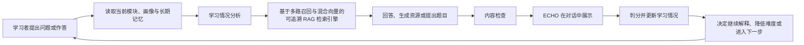
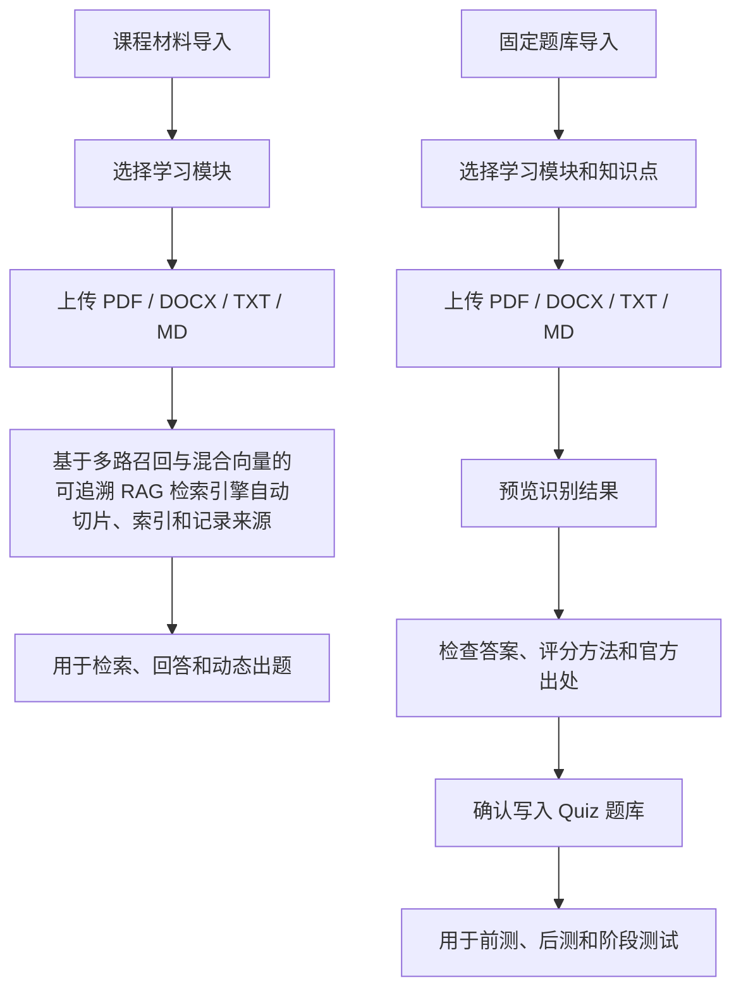

# ECHO Adaptive Skill Training

ECHO 是以对话为主要入口的 Semantic Kernel 企业技能训练系统。学习资料、题目、长期记忆、
课堂微表征和学习报告都服务于同一条对话学习流程。

下文描述比赛版本的目标形态；当前已完成内容和剩余缺口见
[赛题要求映射](docs/competition-requirements.md)。

## 系统做什么

- 围绕三个固定模块开展 Semantic Kernel 技能训练。
- 根据前测、答题记录和 MIRT 结果判断知识盲区与合适难度。
- 通过基于多路召回与混合向量的可追溯 RAG 检索引擎检索 Microsoft 官方材料，支持回答、资源生成和动态出题。
- 生成定制学习资料、实操指南和阶段测试，并在展示前检查答案、难度和出处。
- 使用 SimpleMem 保存跨会话的稳定误区、有效解释方式和历史干预效果。
- 接入课堂微表征结果，根据犹豫、停顿和答案修正调整提示方式。
- 提供知识盲区、难度匹配和个性化学习路径报告。

## 对话学习流程



后台由学习情况分析、内容生成、内容检查和下一步安排四个 Agent 协作；学习者始终只与 ECHO 对话。

## 三个学习模块

| 模块 | 学习内容 | 完成目标 |
|---|---|---|
| M1 Kernel 与插件 | Kernel、模型接入、提示词、插件与函数调用 | 完成能够调用插件的对话应用 |
| M2 Agent 与多智能体协作 | Agent、对话状态、记忆与多个 Agent 协作 | 完成有明确分工的智能体流程 |
| M3 流程、部署与质量评测 | Process Framework、可观测、安全、部署与评测 | 部署并检查智能体应用质量 |

权威内容限定为 Microsoft Learn Semantic Kernel 文档和
`microsoft/semantic-kernel` 官方仓库及示例。

## 两个独立导入入口



固定题目保存题目用途、难度、答案、评分方法、知识点、官方出处和
`是否更新 MIRT`。未完成检查的题目不会写入题库。

学习者在同一 ECHO 对话入口选择前测、阶段测验或后测。后端只从对应
用途的固定题中取题，题目下发时不返回答案和评分方法；学习者提交原始
答案后由服务器判分并保存记录，再按 `是否更新 MIRT` 决定是否更新画像。

## 产品角色

- 学习者：通过 ECHO 对话完成学习、练习、前后测并查看个人报告。
- 讲师/导师：维护课程材料和固定题库，查看学习情况与微表征结果。
- 系统管理员：管理成员身份，配置系统、权限、服务状态和审计记录。
- Demo 模式：位于管理界面，用于展示多智能体闭环，不是独立角色。

## 第一次参与项目先看什么

| 需要了解的问题 | 阅读文档 |
|---|---|
| 系统要做什么、有哪些功能、完整流程是什么 | [系统功能与架构说明](docs/system-overview.md) |
| A、B、C、D 分别做什么、先后顺序是什么 | [四人任务与时间线](docs/team-ownership.md) |
| 数据怎样在主系统、检索引擎、SimpleMem 和微表征之间传递 | [服务接口契约](docs/service-contracts.md) |
| 分支、Commit、PR、命名和合并要求 | [协作与开发规范](docs/collaboration.md) |
| 改完后需要通过哪些测试 | [测试与质量门禁](docs/testing-and-quality.md) |
| 功能是否满足赛题、最终看哪些指标 | [赛题要求映射](docs/competition-requirements.md) |

固定题库的准备格式见 [题库导入模板](docs/quiz-import-template.md)。完整文档导航见
[docs/README.md](docs/README.md)。

## 团队怎样协作

本项目使用 Private 仓库。负责人在 GitHub `Settings -> Collaborators` 中邀请固定成员，
成员接受邀请后直接 Clone 同一个仓库，不使用 Fork。

四个人各使用一个固定工作分支：

```text
member/a-integration       负责人：主系统与总集成
member/b-micro-signal      成员 B：微表征接入
member/c-mirt-memory       成员 C：MIRT、学习总结与 SimpleMem
member/d-content-data      成员 D：官方材料、题库与评测数据
```

`main` 只保存已经检查并能够运行的版本。日常流程为：

```text
在自己的分支修改 -> Commit -> Push -> 创建 PR -> 自动检查 -> 负责人审核 -> 合并到 main
```

B、C、D 的 PR 由负责人审核并合并。负责人在 `member/a-integration` 工作，自动检查
通过后可以自行合并。所有人都不直接向 `main` 推送，也不需要为每个小任务重新创建分支。

第一次下载仓库：

```powershell
git clone https://github.com/Pitkil/echo-adaptive-skill-training.git
cd echo-adaptive-skill-training
powershell -ExecutionPolicy Bypass -File scripts\setup.ps1
```

开始修改前，必须先阅读：

1. [AGENTS.md](AGENTS.md)：系统目标、边界和 Agent 工作要求。
2. [四人任务与时间线](docs/team-ownership.md)：确认自己的任务、交付和配合对象。
3. [协作与开发规范](docs/collaboration.md)：确认分支、Commit、PR 和合并要求。

阅读完成后，由每名成员自行创建并首次 Push 自己的固定分支。以成员 B 为例：

```powershell
git switch main
git pull origin main
git switch -c member/b-micro-signal
git push -u origin member/b-micro-signal
```

每次开始工作前，在自己的分支同步最新 `main`：

```powershell
git fetch origin
git merge origin/main
```

完成一个可以检查的阶段后：

```powershell
git add .
git commit -m "feat(scope): describe the completed change"
git push origin <自己的固定分支>
```

随后在 GitHub 创建目标为 `main` 的 Pull Request。详细要求见
[协作与开发规范](docs/collaboration.md)。

## 本地启动

准备条件：

- Git
- Python 3.11、3.12 或 3.13
- Docker Desktop（使用容器启动时需要）

首次获取仓库后执行：

```powershell
powershell -ExecutionPolicy Bypass -File scripts\setup.ps1
# 填写 .env 中的 OPENAI_API_KEY、OPENAI_BASE_URL 和 OPENAI_MODEL
powershell -ExecutionPolicy Bypass -File scripts\dev.ps1
```

`setup.ps1` 会自动创建 `.venv`、安装开发和测试依赖，并在缺少时生成 `.env`。
默认访问 `http://127.0.0.1:8010`。独立运行的基于多路召回与混合向量的可追溯 RAG 检索引擎默认使用
`http://127.0.0.1:8000`。

公开注册的账号默认是学习者。首次部署时创建系统管理员：

```powershell
.\.venv\Scripts\python.exe scripts\bootstrap_admin.py --username admin
```

使用 Docker 启动：

```powershell
Copy-Item .env.example .env
docker compose up --build -d
docker compose exec echo-api python /workspace/scripts/bootstrap_admin.py --username admin
```

已有账号可追加 `--promote-existing` 提升为系统管理员。系统管理员登录后在“成员管理”
中把负责维护内容的账号设为“讲师/导师”。只有讲师/导师和系统管理员能看到“内容导入”，
只有系统管理员能看到“成员管理”。

外部服务未启动时，主系统保留业务记录并显示降级原因：

- 基于多路召回与混合向量的可追溯 RAG 检索引擎：`http://127.0.0.1:8000`
- SimpleMem：`http://127.0.0.1:8020`
- 微表征检测：`http://127.0.0.1:8030`

## 质量检查

```powershell
powershell -ExecutionPolicy Bypass -File scripts\quality.ps1
powershell -ExecutionPolicy Bypass -File scripts\test.ps1
docker compose config
```

完整流程、架构和功能说明见 [系统功能与架构说明](docs/system-overview.md)，
其他工程文档见 [docs/README.md](docs/README.md)。
