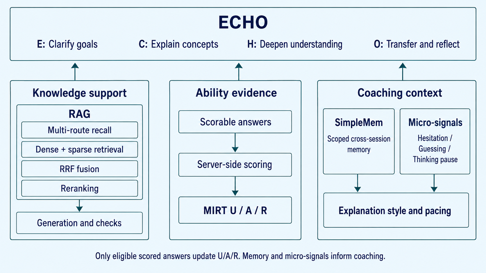

# ECHO Adaptive Skill Training

<div align="center">

<a href="README.md">中文说明</a> · <a href="LICENSE">MIT License</a>


**A conversation-first platform for adaptive skill training.**

ECHO records answers, official evidence, content checks and ability changes in one learning path, then selects the next action.

[](https://github.com/Pitkil/echo-adaptive-skill-training/actions/workflows/ci.yml)


</div>

ECHO is an open-source adaptive skill-training platform. Learners interact with one ECHO assistant; the system reads learning records, retrieves authoritative material, checks generated content and returns one next action.

SimpleMem retrieves learning preferences and prior tutoring records within each user's scope. The real micro-signal detector identifies hesitation, guessing and thinking pauses in authorised audio. These inputs inform explanation style, diagnostic confidence and pacing; only eligible scored answers update MIRT U/A/R.

The repository includes one demonstration course: **enterprise agent development with Microsoft Semantic Kernel**. Additional courses require catalog and knowledge-point configuration, course rubrics, quizzes and source-validation rules; replacing uploaded files alone is insufficient.

<table align="center"><tr>
<td align="center"><strong>1</strong><br><sub>conversation entry</sub></td>
<td align="center"><strong>3</strong><br><sub>learning modules</sub></td>
<td align="center"><strong>4</strong><br><sub>background agents</sub></td>
<td align="center"><strong>U / A / R</strong><br><sub>ability model</sub></td>
<td align="center"><strong>Docker</strong><br><sub>single-repository stack</sub></td>
</tr></table>

## Core design

- **Evidence-centred learning** — questions, answers, video speech, server-side grading and ability changes form a reviewable learning trail.
- **Retrieval is separated from generation** — PunditRAG handles multi-route recall, RRF fusion, reranking and citations; ECHO turns evidence into a learning action.
- **Ability and behaviour stay separate** — only scorable answers update MIRT U/A/R. ASR, pauses and hesitation adjust diagnostic confidence and coaching style, not ability scores directly.
- **Auditable background collaboration** — four internal agents expose their inputs, outputs, failure reasons and final decision in Demo Trace; learners still see one assistant.
- **Fail closed** — unavailable retrieval, memory, transcription or model calls produce an explicit degraded result instead of fabricated citations, scores or ability changes.
- **One reproducible stack** — the business API, PunditRAG, SimpleMem and ASR run from the repository's Docker Compose setup.

## Learning loop

`TurnOrchestrator` selects one primary action from the learner's intent and reads context as needed.
Questions follow the explanation and checking path; eligible submitted answers follow server-side
scoring. The diagram shows responsibilities, not a sequence of services executed on every turn.

<p align="center">
  
</p>
<p align="center"><sub>System overview: E/C/H/O, RAG retrieval, content checks, SimpleMem, micro-signals and MIRT have separate responsibilities.</sub></p>

Every turn has one primary action. Resources retain their check results; unverified personal resources remain available to their owner with the outstanding issues shown. A verified status does not publish them to the course knowledge base. PunditRAG supplies evidence; SimpleMem stores scoped cross-session semantic memory separately from business records.

## Features

| Area | What is implemented |
| --- | --- |
| Curriculum | Three modules: Kernel & plugins; agents & multi-agent collaboration; process, deployment & quality evaluation |
| ECHO orchestration | E/C/H/O state flow with one final learner-facing response |
| Adaptive diagnosis | MIRT U (understanding), A (application), R (reasoning); evidence-backed blind spots and difficulty |
| Knowledge retrieval | PunditRAG service with multi-route retrieval, hybrid vectors, RRF, reranking and traceable evidence |
| Resources | Personalised learning material, hands-on guide and stage test with checking and targeted redo |
| Assessment | Fixed pre-test, stage test, post-test and practice; server-side scoring, idempotency and optional MIRT updates |
| Multimodal input | Video checkpoints, explicit voice consent, ASR transcription and learner confirmation before scoring |
| Memory & signals | Scoped SimpleMem memory plus micro-signal integration for hesitation and pauses |
| Roles | Learner, instructor/mentor and administrator; Demo Trace exposes internal collaboration for authorised demos |

## Interface preview

<table align="center"><tr>
<td width="50%" valign="top"><br><sub>Course center: enter ECHO conversation or video learning from an open course.</sub></td>
<td width="50%" valign="top"><br><sub>Learning workspace: conversation and the system's next action stay in one entry point.</sub></td>
</tr></table>

Learner flow: **Course Center → open course → module → ECHO conversation and adaptive path**. Instructors manage authorised material and fixed questions; administrators manage identities, configuration, service health and audit records.

## Quick start with Docker

Requirements: Docker Desktop with Compose, an LLM-compatible API key, and permission to use any imported course material. Runtime data, uploads and model caches stay outside Git.

```bash
git clone https://github.com/Pitkil/echo-adaptive-skill-training.git
cd echo-adaptive-skill-training
cp .env.example .env
```

Before starting, edit `.env` and set **all** of the following:

```dotenv
OPENAI_API_KEY=your-api-key
OPENAI_BASE_URL=https://api.openai.com/v1
OPENAI_MODEL=your-model
PUNDITRAG_LLM_MODEL=your-model
JWT_SECRET_KEY=independent-random-value-1
SECRET_KEY=independent-random-value-2
SIMPLEMEM_API_KEY=independent-random-value-3
PUNDITRAG_MONGO_PASSWORD=independent-storage-password-1
PUNDITRAG_MINIO_PASSWORD=independent-storage-password-2
```

Generate each application secret independently with at least 32 random bytes. On macOS,
`openssl rand -hex 32` can generate each value. Use URI-safe hexadecimal storage passwords.
The placeholders above must be replaced: startup rejects the sample storage passwords.
For PowerShell instructions, see the [setup guide](docs/team-setup-windows-macos.md).

```bash
docker compose config --quiet
docker compose up --build -d
```

Open <http://127.0.0.1:8010>. Verify the stack:

```bash
curl http://127.0.0.1:8010/api/health
docker compose ps
```

### Windows

Use Docker Desktop with the project's fixed storage policy: installation at `D:\Docker\Docker` and WSL/disk-image data at `D:\DockerDesktopData`. Do not reset Docker Desktop or move the data VHDX back to C:. If the daemon is unavailable, run:

```powershell
Copy-Item .env.example .env
# Edit .env before starting the stack
powershell -ExecutionPolicy Bypass -File scripts\ensure_docker.ps1
docker compose up --build -d
```

The base Compose file intentionally does not start the micro-signal container. Enable the integration Mock explicitly when needed:

```powershell
docker compose --profile micro-mock up --build -d
```

Real detection requires WavLM weights **and** the three matching prototypes. Follow the
[Windows/macOS artifact download and verification guide](docs/micro-real-setup.md) before starting.
The prototype model card currently limits redistribution; use requires the relevant permission.

```powershell
docker compose -f docker-compose.yml -f docker-compose.micro-real.yml --profile micro-real up --build -d
```

Without either profile, a degraded micro-signal status is expected; ECHO, PunditRAG, SimpleMem and ASR can still be healthy.

### macOS

Install Docker Desktop, clone the repository, copy `.env.example` to `.env`, then run the same Compose commands. The default CPU profile works on Intel and Apple silicon. Keep Docker Desktop's virtual disk in a separately managed location with enough space for images and caches.

## Services and ports

| Service | Host endpoint | Purpose |
| --- | --- | --- |
| ECHO API and web app | `8010` | Learner, instructor and admin workflows |
| PunditRAG import | `8000` | Import authorised documents and create chunks |
| PunditRAG query | `8001` | Multi-route retrieval and evidence |
| SimpleMem | internal `8020` | Scoped long-term semantic memory; not published by default |
| Micro-signal service | `8030` (profile required) | Hesitation/pause signal adapter; verify whether the deployment is Mock or real |
| ASR | `8040` | faster-whisper transcription, loaded on first use |
| MinIO API / console | `9100` / `9101` | PunditRAG object storage API and console |

Useful endpoints include `GET /health`, `GET /api/health`, `POST /auth/register`, `POST /auth/login`, `GET /v1/catalog/programs`, `POST /chat` and `GET /v1/resources?module_id=<id>`. The FastAPI OpenAPI page and `docs/service-contracts.md` define the complete contracts.

The micro-signal container is an opt-in profile. Start the integration Mock only when needed with `docker compose --profile micro-mock up -d`; use the real deployment and its model licence for any production or formal accuracy claim.

## Importing your own course

Course materials and fixed quizzes are separate imports. The current application validates Microsoft sources for the demonstration course. Supporting another domain requires updating `apps/api/catalog.py`, course rubrics and source-validation rules, then importing and testing its materials and quizzes. Generated personal resources do not automatically enter the authoritative knowledge base.

The repository includes the import and verification scripts, templates and schemas. Formal competition datasets and personal recordings are not a general benchmark and should be kept in a protected, external delivery folder.

## Privacy and security

- Never commit `.env`, keys, passwords, databases, uploads, audio/video, model weights or personal information.
- Video playback does not open the microphone automatically. Voice checkpoints require explicit consent, transcription and learner confirmation before scoring.
- Answers and scoring rules are never returned to the client; the server grades raw submissions and protects retries with idempotency.
- SimpleMem queries are filtered by organisation and user scope; logout and identity changes clear cached unauthorised state.
- A Mock micro-signal service is for integration testing only and must not be presented as real accuracy results.

## Development and quality gates

```powershell
powershell -ExecutionPolicy Bypass -File scripts\setup.ps1
powershell -ExecutionPolicy Bypass -File scripts\quality.ps1
powershell -ExecutionPolicy Bypass -File scripts\test.ps1
python -m compileall apps/api
docker compose config
```

See `docs/system-overview.md` for architecture, `docs/team-ownership.md` for boundaries, `docs/service-contracts.md` for API contracts and `docs/deployment-and-security.md` for production-oriented deployment. The original Chinese README remains the most detailed reference for project-specific operational notes.

## Project map

```text
apps/api/                 FastAPI app, catalog, database and orchestration
apps/api/agent/           ECHO state machine and one-action turn logic
apps/api/MIRT/            Ability estimation and learner analysis
apps/api/Quiz/            Question selection, scoring and import
apps/api/integrations/    PunditRAG, SimpleMem, micro-signal and ASR adapters
services/punditrag/       Retrieval service bundled in this repository
services/simplemem/       Scoped long-term memory service
scripts/                  Setup, migration, import and test utilities
tests/                    Unit, integration and contract tests
docs/                     Architecture, collaboration and competition notes
```

## Contributing

Please read `AGENTS.md`, `docs/collaboration.md` and `docs/testing-and-quality.md` before making changes. Keep changes scoped, add or update tests, run the quality gates, and open a focused pull request. Do not commit secrets or private evaluation data.

## License and third-party notices

The repository's original code and documentation are released under the [MIT License](LICENSE). Third-party dependencies, model weights, Microsoft documentation and repository content, and user-uploaded materials remain subject to their own licences, terms and permissions. See `models/micro_detector/LICENSE-WAVLM.txt` and the relevant dependency metadata before redistributing bundled assets.
