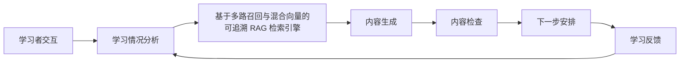

# 系统架构

## 产品目标

ECHO Competition 面向“基于 Microsoft Semantic Kernel 的企业级智能体应用开发”
技能训练，不是通用问答系统。系统依据可判分作答、学习互动、已确认微表征和长期记忆，
决定当前需要讲解、测验、生成资源还是切换模块。

固定学习模块：

1. M1 Kernel 与插件
2. M2 Agent 与多智能体协作
3. M3 流程、部署与质量评测

模块知识来源限定为 Microsoft Learn Semantic Kernel 文档和
`microsoft/semantic-kernel` 官方仓库及示例。基于多路召回与混合向量的可追溯 RAG 检索引擎只负责官方证据检索与溯源。

## 业务闭环

下图是比赛必须完成的目标流程，不表示每一步当前都已经完成。实际进度见
[赛题要求映射](competition-requirements.md)。

- 学习情况分析：成员 C 提供 U/A/R、变化趋势、知识盲区、推荐难度、下一知识点、内容形式、辅导方式、理由和证据来源。
- 证据检索：成员 A 通过基于多路召回与混合向量的可追溯 RAG 检索引擎返回可定位来源。
- 内容生成与检查：成员 A 实现生成和检查流程；成员 D 提供材料、题库和人工判断标准。
- 下一步安排：成员 A 的 `TurnOrchestrator` 每轮只选择一个主要动作。

ECHO 阶段 Agent 继续负责对话教学，不额外建立重复的领域专家 Agent。

## 数据边界

业务数据库保存用户、权限、会话、作答、U/A/R、资源、校验、决策、微表征事件和审计记录。
SimpleMem 保存三类长期语义记忆：

- 常错知识点与稳定误区
- 有效解释方式与学习偏好
- 历史干预及学习效果

数据库事实先提交，SimpleMem 后写入；SimpleMem 异常不能回滚业务事实。

MIRT 以“学习者 + 培训模块”为粒度维护 U/A/R。知识点盲区通过题目标签和作答历史计算。
微表征、互动和长期记忆只增加诊断证据与置信度，不直接修改 U/A/R。

## 核心模型

- 组织与培训：`Organization`、`TrainingProgram`、`TrainingModule`、`KnowledgePoint`
- 会话：`ChatSession`、`Message`、`TurnExecution`
- 能力：`LearnerAbility`、`KnowledgePointReviewState`、`StudentQuestionHistory`
- 证据：`MicroDetectionJob`、`MicroRepresentationEvent`
- 资源闭环：`GeneratedResource`、`VerificationResult`、`LearningDecision`

会话持久化 `program_id`、`module_id`、`knowledge_base_id`、`active_quiz_id`、
`echo_state`、阶段计数和 `context_version`，服务重启后可继续。

## 代码边界

| 路径 | 责任 |
|---|---|
| `apps/api/app.py` | API 组合、认证、路由挂载和降级处理 |
| `apps/api/database.py` | 公共数据模型，由成员 A 独占迁移 |
| `apps/api/agent` | ECHO、FSM、单动作编排 |
| `apps/api/Quiz` | 出题、判分、MIRT 更新和幂等 |
| `apps/api/MIRT` | 成员 C 的能力与综合画像 |
| `apps/api/integrations` | 基于多路召回与混合向量的可追溯 RAG 检索引擎、SimpleMem、微表征服务适配 |
| `services/simplemem` | SimpleMem 8020 独立服务、SQLite 长期记忆库、作用域授权与检索 |
| `apps/api/index.html`、`apps/api/web` | 企业工作台与三个洞察视图 |
| `tests` | 单元、契约和集成测试 |
