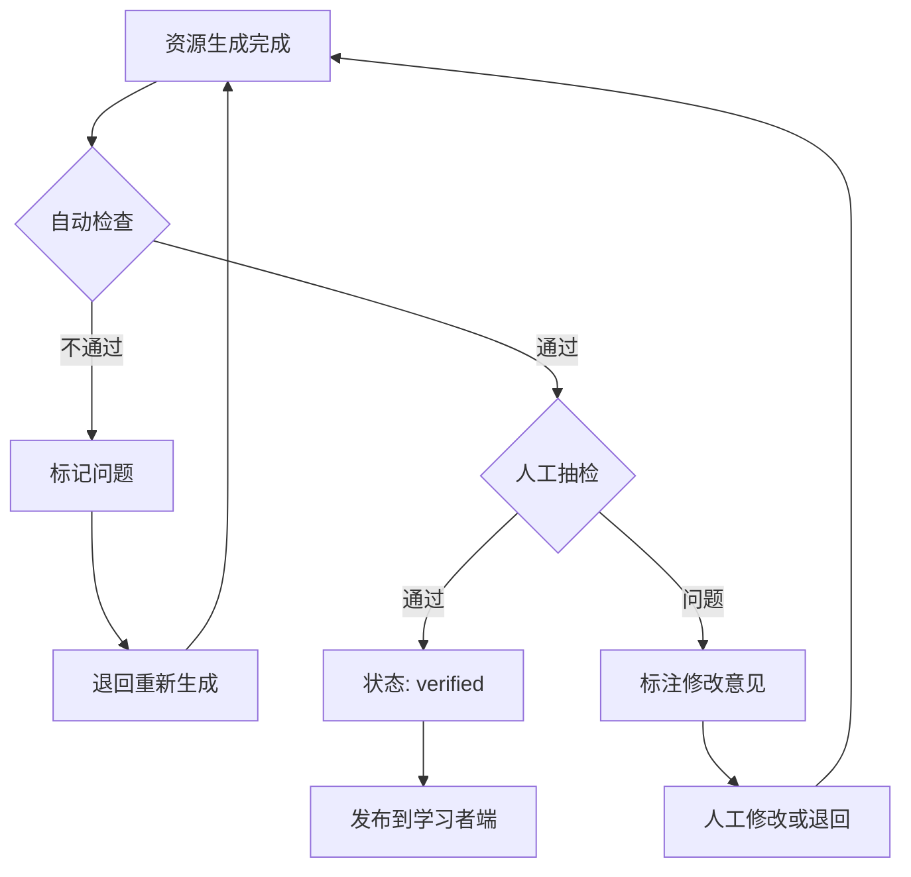

# 三种个性化资源的内容要求与检查标准

本文档为成员 A 的 `ContentVerificationAgent` 提供人工检查标准，同时指导内容生成 Agent 生成符合要求的三种资源。

**知识来源限定**：仅使用 Microsoft Learn Semantic Kernel 文档（`learn.microsoft.com`）和 `microsoft/semantic-kernel` 官方仓库。非 Microsoft 来源不作为依据。

## 一、三类资源的硬性要求

### 1. 定制学习资料（custom_note）

**用途**：帮助学习者理解概念、纠正错误认知、建立知识框架。

**必须包含**：

| 要素 | 说明 | 示例 |
|------|------|------|
| 知识点核心定义 | 用清晰语言说明知识点的含义 | "Kernel 是 Semantic Kernel 的中央编排器..." |
| 官方出处引用 | 至少一处 `[1]` 标记，指向 Microsoft 官方资料 | "[1] Understanding the kernel" |
| 常见易错点或边界 | 说明容易混淆或出错的地方 | "注意：Kernel 不是模型本身，而是编排层" |
| 长度要求 | 不少于 120 字符 | — |

**可选包含**：
- 代码示例（短片段）
- 与已有知识的联系
- 自检问题

**不通过示例**：
- 只写了概念名称，没有解释
- 没有引用任何官方出处
- 内容少于 120 字符
- 使用了非 Microsoft 来源（如个人博客、第三方教程）

### 2. 实践操作指南（practice_guide）

**用途**：帮助学习者完成实际开发任务，掌握操作技能。

**必须包含**：

| 要素 | 说明 | 示例 |
|------|------|------|
| 环境准备 | 列出所需依赖和配置 | "需要 Python 3.11+ 和 Semantic Kernel SDK" |
| 分步操作步骤 | 至少 3 步，每步有明确动作 | "步骤 1：创建 Kernel 实例..." |
| 检查点 | 每 1-2 步设一个验证点 | "检查点：确认 Kernel 已成功创建" |
| 常见失败原因 | 至少 1 个常见问题及排查方法 | "错误：Service not found → 检查是否正确注册" |

**可选包含**：
- 完整代码示例
- 预期输出展示
- 扩展练习

**不通过示例**：
- 操作步骤少于 3 步
- 步骤描述模糊，无法执行（如"配置环境"）
- 没有检查点，无法验证是否成功
- 命令或代码缺少关键信息

### 3. 阶段测试（staged_test）

**用途**：验证学习者对知识点的掌握程度，包含理解、应用、推理三个维度。

**必须包含**：

| 要素 | 说明 | 示例 |
|------|------|------|
| 理解题 | 测试概念理解 | "Kernel 的核心作用是什么？" |
| 应用题 | 测试操作能力 | "写出创建 Kernel 并注册服务的代码" |
| 推理题 | 测试分析判断能力 | "比较两种 Plugin 实现方式，说明选择依据" |
| 难度标签 | 明确标注 foundation/standard/advanced | "难度：standard" |
| 评分方法 | 明确分值分配 | "答出核心概念得 2 分，举例得 1 分" |

**不通过示例**：
- 只有理解题，缺少应用或推理题
- 没有评分方法或评分方法模糊（如"由系统判断"）
- 难度标签缺失或与内容不符

## 二、内容检查标准

### 自动检查（由 ContentVerificationAgent 执行）

`resource_generation.py` 中的 `ContentVerificationAgent.verify()` 自动检查以下四项：

| 检查项 | 通过条件 | 失败时的问题描述 |
|--------|----------|------------------|
| 证据引用 | 有 PunditRAG 证据且内容包含 `[1]` | "PunditRAG 未返回可追溯证据" 或 "内容没有标记证据引用" |
| 知识点覆盖 | 资源内容包含目标知识点名称 | "内容未覆盖目标知识点" |
| 内容长度 | 内容字符数 ≥ 120 | "内容过短，无法形成完整学习资源" |
| 难度有效 | 难度为 foundation/standard/advanced 之一 | "推荐难度无效" |

> **注意**：自动检查通过（`passed=True`）时，资源状态变为 `verified`。但自动通过不代表人工审核通过。

### 人工检查标准（供审核人员使用）

当自动检查通过但需要人工复核，或自动检查失败需要判断是否可修复时，使用以下标准：

#### 检查项 1：事实准确性

| 等级 | 标准 | 处理方式 |
|------|------|----------|
| ✅ 准确 | 与 Microsoft 官方资料一致，无错误 | 通过 |
| ⚠️ 有歧义 | 表述不够精确，但未与官方冲突 | 标注后通过或修改 |
| ❌ 错误 | 与官方资料冲突，或包含错误信息 | 退回重新生成 |

**错误示例**：
- 错误描述 Kernel 为“模型训练工具”
- 说 Plugin 只能用 C# 编写
- 编造不存在的 API 或方法名

#### 检查项 2：步骤可执行性（仅操作指南）

| 等级 | 标准 | 处理方式 |
|------|------|----------|
| ✅ 可执行 | 步骤清晰、命令完整、可复现 | 通过 |
| ⚠️ 信息缺失 | 步骤方向正确但缺少关键参数 | 补充后通过 |
| ❌ 不可执行 | 步骤模糊、命令错误、无法复现 | 退回重新生成 |

**错误示例**：
- 步骤“配置模型服务”但没有给出具体配置项
- 代码示例中使用了不存在的参数
- 缺少环境准备步骤

#### 检查项 3：难度匹配

| 学习者类型 | 推荐难度 | 判断依据 |
|------------|----------|----------|
| P1（基础薄弱） | foundation 或 standard | 是否有详细解释、基础示例 |
| P2（理论较好，实践弱） | standard | 是否有操作步骤、代码示例 |
| P3（有开发经验） | standard 或 advanced | 是否有综合分析、架构设计 |

**不匹配示例**：
- P1 学习者收到 advanced 难度的内容
- P3 学习者收到 foundation 难度的内容（过于简单）

#### 检查项 4：引用可查性

| 等级 | 标准 | 处理方式 |
|------|------|----------|
| ✅ 可查 | source_url 可打开，章节对应 | 通过 |
| ⚠️ 部分可查 | 链接可打开但章节偏移 | 标注后通过 |
| ❌ 不可查 | 链接 404 或章节不存在 | 退回修正 |

**验证方式**：
- 点击 `source_url` 确认可访问
- 在页面中搜索 `source_section` 确认章节存在
- 确认内容与资料一致

#### 检查项 5：个性化适配度

| 等级 | 标准 | 处理方式 |
|------|------|----------|
| ✅ 适配 | 内容明显考虑了学习者能力水平 | 通过 |
| ⚠️ 基本适配 | 内容与学习者水平大致匹配 | 通过 |
| ❌ 不适配 | 内容与学习者水平明显不匹配 | 标注建议 |

**判断依据**（来自 `PersonalizationPlan`）：
- `difficulty`：难度等级
- `weakest_dimension_label`：重点补强维度（理解/应用/推理）
- `support_strategy`：支持策略（拆分步骤/提供提示）
- `reason`：个性化原因

## 三、官方资料引用规范

### 引用格式要求

1. **标记方式**：在内容中使用 `[1]`、`[2]` 等上标标记，对应到 `evidence_sources` 列表
2. **每个引用必须可查**：包含 `source_title`、`source_url`、`source_section`
3. **引用数量**：每个资源至少 1 个引用（最好 2-3 个）

### 允许的资料来源

| 来源 | 链接格式 | 示例 |
|------|----------|------|
| Microsoft Learn | `https://learn.microsoft.com/...` | `https://learn.microsoft.com/en-us/semantic-kernel/concepts/kernel` |
| Microsoft SK GitHub | `https://github.com/microsoft/semantic-kernel/...` | `https://github.com/microsoft/semantic-kernel/blob/main/README.md` |

### 禁止的资料来源

- 个人博客（如 Medium、dev.to、个人网站）
- 第三方教程网站（如 Stack Overflow、CSDN）
- 非 Microsoft 的 AI 框架文档
- 任何非 Microsoft 官方来源

## 四、不同学习者类型的资源要求

### P1：基础薄弱

| 维度 | 要求 |
|------|------|
| 讲解深度 | 使用生活化比喻，侧重“是什么”和“为什么”，避免过多术语 |
| 代码复杂度 | 尽可能简单，使用最小的可运行示例 |
| 操作步骤 | 提供详细的、一步步的指引 |
| 练习难度 | foundation 为主，少量 standard |
| 支持方式 | 提供更多提示和引导 |

**内容特点**：
- 每个概念用 1-2 个例子说明
- 代码示例带注释
- 步骤说明中提示可能出现的错误

### P2：理论较好但实践较弱

| 维度 | 要求 |
|------|------|
| 讲解深度 | 侧重“怎么用”，与理论结合，但保持适度深度 |
| 代码复杂度 | 中等复杂度，包含完整实现 |
| 操作步骤 | 提供中等详细度的步骤，鼓励独立思考 |
| 练习难度 | standard 为主，部分 advanced |
| 支持方式 | 提供关键提示，不替代学习者操作 |

**内容特点**：
- 每段概念后跟一个可运行的示例
- 操作指南中设置“思考点”
- 阶段测试包含完整的实现要求

### P3：有开发经验

| 维度 | 要求 |
|------|------|
| 讲解深度 | 深入探讨原理、架构和最佳实践，关注工程取舍 |
| 代码复杂度 | 完整的、生产级的代码结构 |
| 操作步骤 | 提供高层级指导，或直接给出挑战性任务 |
| 练习难度 | advanced 为主，部分 standard |
| 支持方式 | 提供开放性问题和扩展方向 |

**内容特点**：
- 讨论设计决策和权衡
- 操作指南以目标任务为导向
- 推理题需要综合多个知识点

## 五、资源质量检查流程图

## 六、检查结果记录格式

审核人员记录检查结果时，使用以下格式：
### 资源审核记录

- **资源 ID**：xxx
- **资源类型**：custom_note / practice_guide / staged_test
- **知识点**：xxx
- **难度**：foundation / standard / advanced
- **目标学习者**：P1 / P2 / P3

**自动检查结果**：
- factual_score: 1.0
- coverage_score: 1.0
- difficulty_score: 1.0
- passed: True

**人工复核结果**：
- 事实准确性：✅ 通过
- 步骤可执行性：✅ 通过（不适用时填 N/A）
- 难度匹配：✅ 通过
- 引用可查性：✅ 通过
- 个性化适配度：✅ 通过

**修改建议**：（如有问题）
- 无

**审核人**：xxx
**日期**：2026-08-11