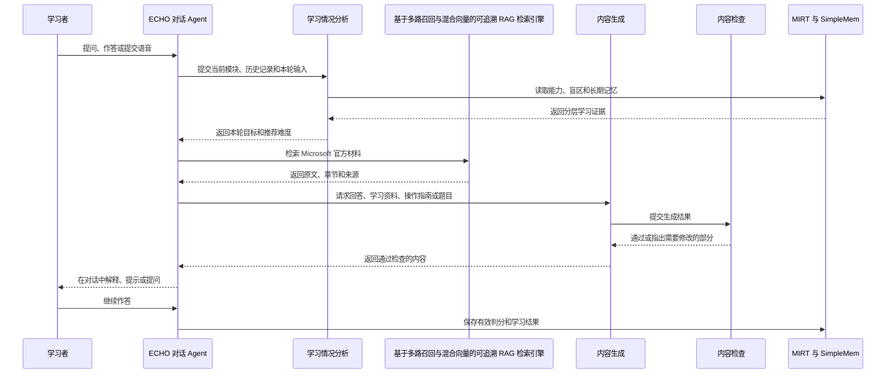
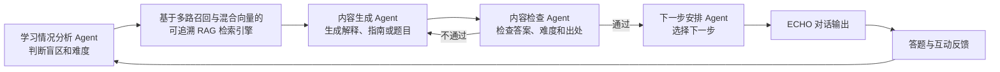
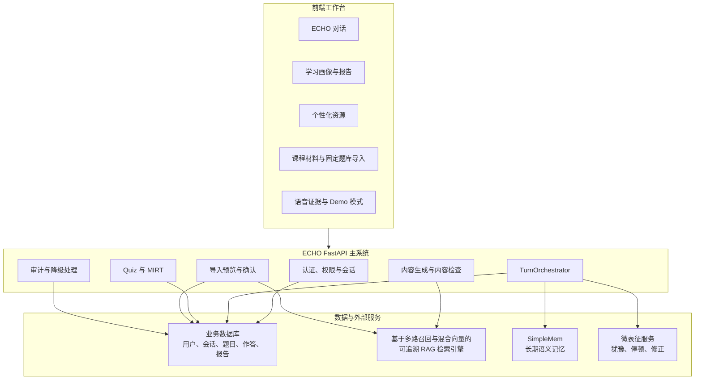
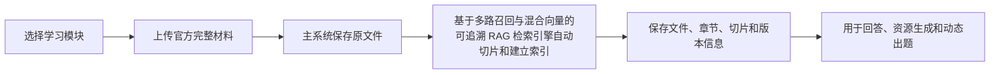
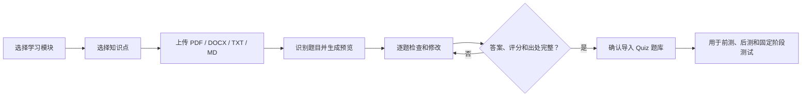

# ECHO 系统功能与架构说明

## 1. 产品定位

ECHO 是一个以对话为主要入口的个性化技能训练 Agent。当前比赛演示领域为
“基于 Microsoft Semantic Kernel 的企业级智能体应用开发”。

本文说明比赛版本最终必须做成什么，不代表所有功能当前已经完成。当前进度和剩余缺口见
[赛题要求映射](competition-requirements.md)，具体负责人见
[四人任务与时间线](team-ownership.md)。

学习者不需要在多个系统之间切换。ECHO 在对话过程中调用学习情况分析、官方材料检索、
内容生成、内容检查、固定题库、长期记忆和微表征功能，并根据新的学习结果安排下一轮。

## 2. 用户与界面

| 产品身份 | 主要界面 | 能够完成的工作 |
|---|---|---|
| 学习者 | 课程中心、ECHO 导学工作台、视频伴学、学习画像、个性化资源、语音证据 | 选择已开放课程、对话学习、观看本地课程视频、答题、查看报告、提交授权语音 |
| 讲师/导师 | 学习者功能、内容导入、批量语音、学习情况 | 导入课程材料和固定题库、查看学习效果 |
| 系统管理员 | 成员管理、服务状态、审计和 Demo 模式 | 分配学习者与讲师身份、配置系统、查看完整闭环 |

学习情况分析 Agent、内容生成 Agent、内容检查 Agent 和下一步安排 Agent 不是产品身份，
不分别建立独立界面。

公开注册始终生成学习者账号。系统管理员通过部署脚本初始化，并在“成员管理”中分配
讲师/导师身份。课程材料和固定题库导入只对讲师/导师与系统管理员显示。

课程中心只把已经在运行目录中配置的课程标记为可学习。比赛版本只有
“基于 Microsoft Semantic Kernel 的企业级智能体应用开发”可以进入；其他课程方向只作为
“课程样例 / 即将开放”展示，不伪造课时、进度或学习内容。进入正式课程后，学习者仍以
ECHO 对话作为主要学习入口。

视频伴学使用浏览器原生播放器。当前本地演示由学习者选择本机视频，文件不会上传，播放进度
按用户、课程、模块和文件保存在当前设备。视频播放、暂停和拖动进度不会自动开启麦克风；
系统只在学习节点暂停并给出口述练习提示。学习者进入“语音证据”页、明确勾选本轮授权并主动
开始录音后，音频才会提交微表征服务。该证据可以绑定当前模块和知识点，只调整提示节奏与
辅导方式，不直接修改 U/A/R。

## 3. 学习内容

| 模块 | 主要知识范围 | 代表性任务 |
|---|---|---|
| M1 Kernel 与插件 | Kernel、模型服务、提示词、多轮对话、插件和函数调用 | 创建能够调用插件的对话应用 |
| M2 Agent 与多智能体协作 | Agent、线程状态、记忆、多个 Agent 分工协作 | 创建能够保存状态并协作完成任务的流程 |
| M3 流程、部署与质量评测 | Process Framework、日志、安全、异常、部署和评测 | 部署应用并检查输出与协作质量 |

三个模块完成后安排一个综合任务，不增加第四个模块。

## 4. 完整学习流程

每轮只执行一个主要动作，避免同一轮同时判分、出题、切换模块和生成资源。

## 5. 多智能体闭环

基于多路召回与混合向量的可追溯 RAG 检索引擎是证据服务，不是重复的领域专家 Agent。ECHO 是唯一直接与学习者说话的 Agent。

## 6. 系统架构

业务数据库保存用户、权限、会话、题目、答案、作答、MIRT、生成资源和审计事实。
SimpleMem 只保存长期语义记忆，不能替代业务数据库。

## 7. 两个导入流程

### 7.1 课程材料导入

材料仅需人工记录名称、官方链接、版本或日期、所属模块和相关章节。
切片编号和内容哈希由基于多路召回与混合向量的可追溯 RAG 检索引擎自动生成。

### 7.2 固定题库导入

每道固定题保存：

- 题目用途：前测、后测、阶段测试或练习。
- 难度：基础、标准或进阶。
- 题目、答案和评分方法。
- 学习模块与知识点。
- 资料名称、官方链接和出处章节。
- 是否允许本题结果更新 MIRT。

未确认的预览不会写入 Quiz 题库。重复题目在确认时跳过。
学习者端不选择前测、阶段测验或后测，只看到系统当前安排的一个下一步。
后端按固定顺序检查前测完成状态、各知识点练习覆盖、阶段测验是否达到 70% 和后测完成状态，
并严格按已解锁用途取题。阶段未达标时先安排新的巩固练习，完成后才允许重测。
下发题目时隐藏答案和评分方法；提交时只接收原始答案，由服务器判分、保存
作答记录，并按题目开关决定是否更新 MIRT。

## 8. 系统功能

| 功能 | 系统行为 |
|---|---|
| 对话导学 | ECHO 按 E、C、H、O 阶段解释、追问、提示和迁移 |
| 固定前测 | 首次进入模块时了解初始水平 |
| 自适应练习 | 根据 MIRT、知识盲区和目标难度选择题目 |
| 模块后测 | 模块结束时使用同范围不同题面检查变化 |
| 动态出题 | 先调用基于多路召回与混合向量的可追溯 RAG 检索引擎，再生成并校验题目 |
| 三类资源 | 生成定制学习资料、实操指南和阶段测试 |
| 内容校验 | 检查知识点、答案、步骤、难度和官方出处 |
| 长期记忆 | 保存稳定误区、有效解释方式和干预效果 |
| 微表征辅助 | 根据犹豫、停顿和答案修正调整提示，不直接改写 MIRT |
| 学习报告 | 展示能力现状和变化趋势、有作答依据的知识盲区、推荐难度、下一知识点、推荐内容形式、推荐辅导方式、推荐原因和证据来源 |
| 课程材料导入 | 将完整官方材料送入基于多路召回与混合向量的可追溯 RAG 检索引擎 |
| 固定题库导入 | 预览检查后将固定题写入 Quiz 题库 |
| 审计与降级 | 保存每轮决策；外部服务异常时保留业务事实 |

学习总结先由程序根据前测和已判分题目计算，再结合已确认微表征和长期记忆。
大模型只把已有结果写成容易理解的文字，不能自行补充结论；大模型不可用时使用
固定模板。每条盲区、难度和路线建议必须能够找到对应证据。

## 9. 四人工作合起来必须得到什么

- A 交付可运行主系统、四个后台 Agent、检索引擎、题库导入、生成检查、评分和评测程序。
- B 交付可定位到录音时间的微表征结果、课次汇总、识别效果和 10 组案例。
- C 交付能力现状和变化趋势、有作答依据的知识盲区、推荐难度、下一知识点、
  推荐内容形式、推荐辅导方式、推荐原因、证据来源、三部分报告和长期记忆。
- D 交付官方材料、63 道固定题、三种资源检查标准和 50 组评测参考结果。

四部分缺少任何一项，都不能算完成赛题闭环。

## 10. 评测

冻结 50 组端到端对话案例：

- 36 组基础对话：三类学习者、三个模块、四种任务。
- 9 组动态调整：答错降难、答对升难、犹豫后改变提示。
- 5 组异常情况：无资料、校验失败、重复提交、服务不可用和切换模块。

目标指标：

- 内容错误率（包括无依据或与官方资料冲突）低于 5%。
- 难度适配率不低于 85%。
- 核心知识点覆盖率不低于 90%。
- 官方出处可追溯率目标 100%。
