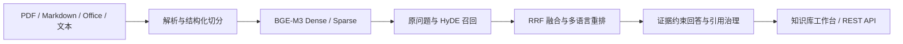
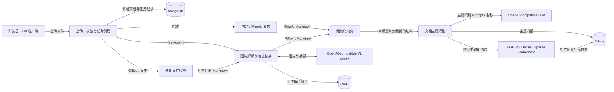
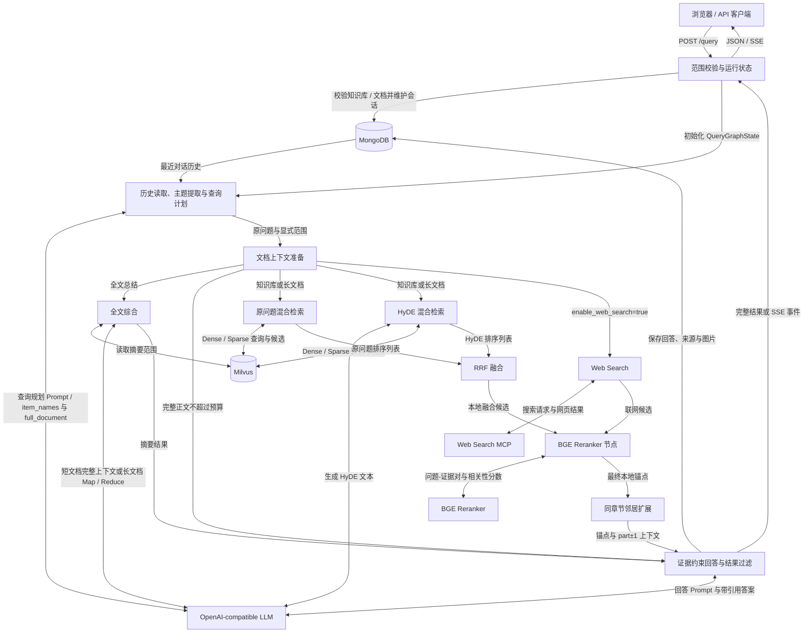
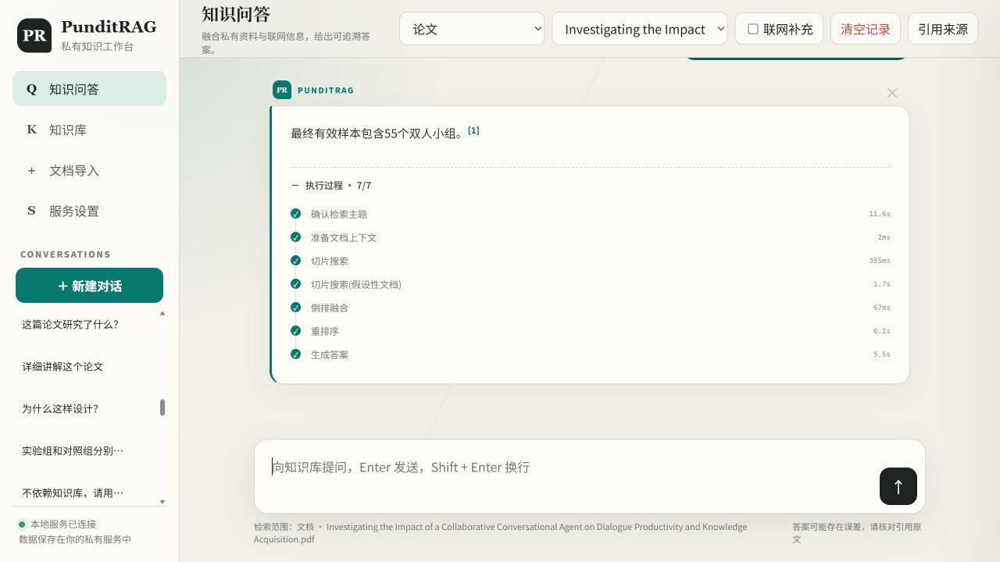
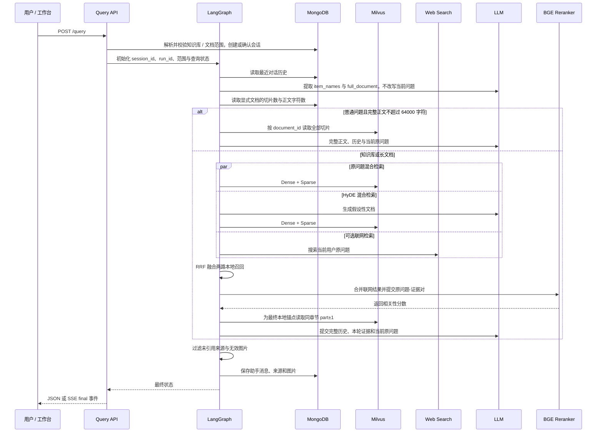

<div align="center">

# PunditRAG

> ECHO 集成说明：本目录是随 ECHO 一起发布的检索引擎源码。团队日常部署请回到仓库根目录，
> 复制根 `.env.example` 并运行 `docker compose up --build -d`；不要另建第二份 `.env.docker`，
> 也不要单独运行本目录的 Compose。根配置默认 CPU，NVIDIA 用户使用根目录
> `docker-compose.gpu.yml`。

**面向中文技术资料的可追溯 RAG 知识库系统**

从文档导入、混合检索和精排，到流式回答、引用治理与可复现评测的一体化工程实现。

[](https://www.python.org/)
[](https://github.com/langchain-ai/langgraph)
[](https://github.com/Pitkil/PunditRAG/actions/workflows/ci.yml)
[](LICENSE)

[快速开始](#快速开始) · [系统架构](#系统架构) · [对话流程](#对话处理过程) · [评测结果](#评测结果) · [API](#api-概览)

</div>

PunditRAG 面向需要“导入资料后直接提问”的实际使用场景。来自知识库的型号、编号、数值和日期必须由真实引用支持；资料不足时仍可使用模型通识回答，但会明确显示“AI 通识回答”，不伪造资料来源。

## 项目一览



## 界面预览


工作台将知识库与文档范围、回答正文、引用编号和来源原文放在同一界面，并提供单条消息删除、聊天记录清空和联网补充开关。

## 目录

- [项目一览](#项目一览)
- [界面预览](#界面预览)
- [快速开始](#快速开始)
- [核心能力](#核心能力)
- [系统架构](#系统架构)
- [对话处理过程](#对话处理过程)
- [部署说明](#部署说明)
- [配置说明](#配置说明)
- [使用方式](#使用方式)
- [API 概览](#api-概览)
- [Prompt 设计](#prompt-设计)
- [评测结果](#评测结果)
- [测试](#测试)
- [安全与可靠性](#安全与可靠性)
- [项目结构](#项目结构)
- [参与贡献](#参与贡献)
- [许可证](#许可证)

## 快速开始

准备 Docker Desktop 后，复制环境变量模板并填写模型、MinerU、MongoDB 和 MinIO 的凭据：

```powershell
Copy-Item .env.docker.example .env.docker
notepad .env.docker
```

启动全部服务：

```powershell
.\start.ps1
```

首次启动会自动构建应用镜像并下载 Embedding 与 Reranker 模型；后续启动会直接复用现有镜像。服务就绪后打开知识库工作台：<http://127.0.0.1:8001/query/html>。

完整的 GPU/CPU 要求、手动 Compose 命令、服务地址和日志操作见[部署说明](#部署说明)。

## 核心能力

| 能力 | 实现 |
|---|---|
| 多格式知识入库 | PDF、Markdown、Office、文本与表格统一转换为结构化 Markdown，并保留章节和图片上下文 |
| 自适应文档上下文 | 短文档完整直读；长文档混合检索后补齐同章节相邻切片；整份总结使用 Map/Reduce |
| 多路检索与精排 | 原问题与 HyDE 并行执行 Dense + Sparse 召回，经 RRF 融合和多语言 Reranker 精排 |
| 可追溯回答 | 资料事实使用连续 `[n]` 引用；无证据时允许明确标识的 AI 通识回答；越界引用直接拦截 |
| 可用工作台 | 管理知识库、文档和会话，观察执行过程，流式接收答案，删除单条消息或清空聊天记录 |

<details>
<summary><strong>展开查看完整能力清单</strong></summary>

### 文档导入

- 使用 MinerU API 将 PDF 转换为 Markdown。
- 支持直接导入 `.md`，并可将 `.txt`、`.docx`、`.pptx`、`.xlsx`、`.csv`、`.html`、`.htm`、`.json` 转换为 Markdown。
- 按 Markdown 标题、段落、表格和表格行进行结构化切分。
- 默认以近似 token 计数控制 `500` token 切片和 `80` token 重叠。
- 对密集的“字段 + 参数”技术指标按行分组，并在每个子切片中保留章节标题。
- Embedding 文本包含文档名、章节名和主题信息，降低脱离上下文的误召回。
- 切片向量写入 Milvus，知识库、文档与会话元数据写入 MongoDB，Markdown 图片处理路径中的图片写入 MinIO；导入中间文件保存在 `temp-files/`。

### 检索与回答

- BGE-M3 Dense + Sparse 混合召回。
- 原始问题检索与 HyDE 假设文档检索并行执行。
- 使用 RRF 融合多路结果，再通过 BGE Reranker 精排。
- 主题匹配作为召回扩展，不作为可能漏召回的硬过滤条件。
- 高于重排阈值的候选进入常规回答；全部低于阈值但仍有非零相关分时，保留少量低置信候选交给回答模型核验。精排为 `0.0` 的完全无关候选不进入回答上下文。
- 没有检索证据时仍允许模型使用稳定通识回答，并在答案开头明确显示“AI 通识回答”；引用越界仍会拒绝整份答案。
- 查询范围显式区分全部知识库、指定知识库和指定文档；文档范围会生成精确的 `document_id` 过滤条件。
- 显式选择的文档正文不超过 `64000` 字符且未启用联网时，任何普通问题都直接读取完整正文，避免 Top-K 召回损失。
- 更长的文档保持原问题与 HyDE 并行召回；Reranker 选出最终锚点后，再补充同章节前后各一个切片。
- 明确要求整份资料总结时进入全文综合：短文档直接综合完整上下文，长文档使用 Map/Reduce 分批处理。
- 回答模型同时接收完整用户/助手历史、本轮检索正文和当前用户原话；历史只辅助理解，不接管检索范围。
- 跨网页与本地资料去重时优先保留本地原文；回答使用连续的 `[n]` 引用，API 只返回实际引用的证据。
- 联网补充默认关闭；显式开启后，联网失败只降级联网分支，不影响本地知识库检索。
- HyDE 是辅助召回分支，默认最多等待 10 秒；调用超时或失败时自动跳过 HyDE，继续使用普通检索回答。
- 查询规划默认最多等待 10 秒；失败时使用空主题和普通检索降级，不阻断本轮问答。

### 工作台与运维

- 知识库、文档和会话管理。
- 支持删除任意单条用户或助手消息，也可清空当前会话的全部聊天记录；生成期间禁止删除，避免历史状态竞争。
- 非流式响应与 SSE 流式响应。
- MongoDB、Milvus、MinIO 真实依赖健康检查。
- 文档删除时同步清理向量、对象存储、本地文件和元数据。
- 自建集及 RGB、CRUD-RAG、MTRAG 评测适配器。

</details>

## 系统架构

### 文档导入架构



### 查询与回答架构



<details>
<summary><strong>展开查看：导入架构每条箭头的含义</strong></summary>

### 导入链路箭头说明

| 箭头 | 传递内容 | 作用 |
|---|---|---|
| 客户端 → 上传、校验与任务创建 | 文件、`kb_id` | 校验知识库、扩展名、文件名、数量和大小，创建独立导入任务。 |
| 上传、校验与任务创建 → MongoDB | 知识库、文档和任务元数据 | 记录 `document_id`、文件名、状态、错误与切片数量，供工作台查询。 |
| 上传、校验与任务创建 → PDF / MinerU 转换 | `.pdf` 文件路径 | 申请 MinerU 上传地址、轮询解析任务、下载并解压结果，得到 Markdown。 |
| 上传、校验与任务创建 → Office / 文本转换 | `.txt`、`.docx`、`.pptx`、`.xlsx`、`.csv`、`.html`、`.htm`、`.json` 文件路径 | 在本地抽取正文、表格等内容并生成统一 Markdown。 |
| 上传、校验与任务创建 → 图片解析 | 原生 `.md` 文件路径 | Markdown 无需内容转换，直接检查其同目录图片资源。 |
| PDF / MinerU 转换 → 结构化切分 | MinerU 返回的 Markdown | 当前 PDF 路径直接进入切分，不经过 Markdown 图片摘要与 MinIO 上传节点。 |
| Office / 文本转换 → 图片解析 | 转换后的 Markdown | 复用 Markdown 图片处理节点；没有图片时直接透传正文。 |
| 图片解析 ↔ VL Model | 图片、相邻正文 ↔ 单行客观摘要 | 为图片生成可检索的替代文本；无法识别时写入固定失败提示，不虚构内容。 |
| 图片解析 → MinIO | 从 Markdown 发现的本地图片 | 上传到私有 Bucket，并用受控资源地址替换本地路径。 |
| 图片解析 → 结构化切分 | 图片地址已规范化的 Markdown | 保证后续切片携带可访问的图片上下文。 |
| 结构化切分 → 文档主题识别 | 标题、段落、表格及切片元数据 | 按标题和近似 token 预算切分，密集参数表按行分组并保留标题。 |
| 文档主题识别 → LLM | 文件标题和前若干切片 | 请求模型识别文档的规范主题名称。 |
| LLM → 文档主题识别 | 单行主题名称 | 将主题写入每个切片；无法识别时回退到文件标题。 |
| 文档主题识别 → Milvus | 主题名称的 Dense/Sparse 向量 | 建立资料主题索引，用于查询阶段的召回扩展。 |
| 文档主题识别 → BGE-M3 Embedding | 带文档名、章节名和主题的切片 | 为切片补足上下文后批量生成向量。 |
| BGE-M3 Embedding → Milvus | 切片正文、元数据、Dense/Sparse 向量 | 写入知识库切片集合，作为本地混合检索的数据源。 |

</details>

<details>
<summary><strong>展开查看：查询架构每条箭头的含义</strong></summary>

### 查询链路箭头说明

| 箭头 | 传递内容 | 作用 |
|---|---|---|
| 客户端 → 请求校验与运行状态 | 问题、`session_id`、`scope_mode`、`kb_ids`、`document_ids`、流式与联网开关 | 创建本轮 `run_id`，把“全部知识库 / 指定知识库 / 指定文档”解析成明确范围，并选择同步或后台执行。 |
| 请求校验与运行状态 → MongoDB | 会话 ID、首轮问题、知识库 ID、文档 ID | 创建或确认会话，验证请求中的知识库与文档，并在指定文档时反查所属知识库。 |
| 请求校验与运行状态 → 查询规划 | 初始化后的 `QueryGraphState` | 将本轮所有输入放入 LangGraph 状态，其中 `original_query` 始终保存当前用户原话。 |
| MongoDB → 查询规划 | 当前会话最近的用户与助手消息 | 只为识别已明确的主题和理解对话上下文提供辅助，不自动继承上一轮文档范围。 |
| 查询规划 ↔ LLM | 历史、当前原问题 ↔ `item_names`、`full_document` | 只提取辅助召回主题，并判断是否明确要求完整覆盖当前范围；超时或解析失败时降级到普通检索。 |
| 查询规划 → 文档上下文准备 | 当前原问题、`full_document` 和显式文档范围 | 不猜查询类型；全文总结优先进入综合节点，其他显式文档按正文大小选择完整直读或常规检索。 |
| 文档上下文准备 → 证据约束回答 | 不超过 `DIRECT_DOCUMENT_MAX_CHARS` 的完整切片 | 未启用联网时直接提交所选文档完整正文，避免短文档经过 Top-K 后丢失章节。 |
| 文档上下文准备 → 原问题混合检索 | 当前原问题、可选主题扩展、知识库或长文档范围 | 启动第一路本地检索，查询文本始终保留当前用户原话。 |
| 文档上下文准备 → HyDE 混合检索 | 当前原问题、可选主题扩展和显式范围 | 启动第二路召回，用假设性文档弥补问题和资料表达之间的差异。 |
| 文档上下文准备 → Web Search | 当前原问题 | 仅在 `enable_web_search=true` 时启动；启用联网时不走短文档直读，确保网页与本地候选统一处理。 |
| 文档上下文准备 → 整份资料摘要 | 当前原问题与 `full_document=true` | 明确全文总结绕过 Top-K 问答检索；短文档直接全文综合，长文档进入 Map/Reduce。 |
| 原问题混合检索 ↔ Milvus | Dense/Sparse 查询向量 ↔ 候选切片 | 在 `kb_id` 或 `document_id` 范围内执行加权混合检索，返回第一份有序候选。 |
| HyDE 混合检索 ↔ LLM | 当前原问题 ↔ 不含精确虚构事实的 HyDE 文本 | 生成更接近资料语言的检索扩展文本，不直接作为最终答案。 |
| HyDE 混合检索 ↔ Milvus | HyDE Dense/Sparse 向量 ↔ 候选切片 | 返回第二份有序候选。 |
| Web Search ↔ Web Search MCP | 搜索请求 ↔ 标题、正文摘要和 URL | 获得可选外部候选；它不进入本地 RRF。 |
| 两路本地检索 → RRF | 两份有序候选列表 | 按排名而非原始分数融合，降低不同检索分数尺度造成的偏差。 |
| RRF → Reranker | 去重后的本地融合候选 | 输出本地候选池并限制融合结果数量。 |
| Web Search → Reranker | 统一格式后的网页候选 | 在精排前与本地候选合并；近似重复时优先本地原文，因此网页结果不会挤占同内容的本地证据。 |
| Reranker ↔ BGE Reranker | 当前原问题-证据文本对 ↔ 归一化相关性分数 | 使用用户原话重新排序全部候选，并依据阈值、分差和数量上限选择证据。 |
| Reranker → 同章节邻居扩展 | 显式文档范围内的最终本地锚点及其 `document_id`、`parent_title`、`part` | 仅对用户明确选择的长文档锚点补充同章节 `part±1`，补齐被切片边界截断的上下文；知识库范围、网页和缺少顺序元数据的候选不扩展。 |
| 同章节邻居扩展 → 证据约束回答 | 锚点、真实相邻正文与证据等级 | 邻居只补上下文，不改变锚点相关度，不挤占原始语义候选。 |
| 整份资料摘要 ↔ Milvus | 知识库或文档范围 ↔ 最多 `SUMMARY_MAX_CHUNKS` 个切片 | 读取所选范围内的资料并按文档、章节和分片顺序排列。 |
| 整份资料摘要 ↔ LLM | 完整文档上下文，或分批 Map Prompt、Reduce Prompt ↔ 带引用综合结果 | 短文档一次生成，超出阈值的长文档分批处理，并保留范围、冲突和引用。 |
| 摘要结果 → 证据约束回答 | 已完成的摘要与来源 | 复用统一的保存和输出节点，不再执行常规问答生成。 |
| 证据约束回答 ↔ LLM | 本轮编号证据、完整用户/助手历史、当前原问题、辅助主题和证据等级 ↔ 带 `[n]` 引用的答案 | 当前原话决定回答任务，历史帮助理解语境，检索正文提供事实依据；三者职责分离。 |
| 证据约束回答 → MongoDB | 用户原话、助手答案、查询范围、实际引用来源和图片 | 形成可继续追问、可回看和可审计的独立消息记录；每条消息具有唯一 ID，但下一轮检索范围仍以新请求显式参数为准。 |
| 证据约束回答 → 请求校验与运行状态 | 答案、来源、图片、消息 ID、任务轨迹 | 非流式请求形成完整 JSON；流式请求形成 `delta` 与 `final` 事件，最终事件携带本轮用户和助手消息 ID。 |
| 请求校验与运行状态 → 客户端 | JSON 或 SSE | 将最终结果和执行状态返回工作台或 API 调用方。 |

</details>

普通问答主链路：

```text
查询规划 -> 文档上下文判断 -> 原问题/HyDE 并行召回 -> RRF -> Reranker -> 邻居扩展 -> 回答与引用过滤
```

## 对话处理过程

一次对话同时使用两个标识：`session_id` 表示可持续多轮的会话，负责关联历史消息；`run_id` 表示单次请求，负责隔离任务状态、节点追踪和 SSE 事件。即使同一会话连续发起查询，每轮也有独立的 `run_id`。



工作台通过 SSE 实时更新本轮执行过程；图中展示的是一次普通文档问答实际经过的主题确认、文档上下文准备、原问题与 HyDE 检索、RRF 融合、重排序和答案生成。



<details>
<summary><strong>展开查看：一次请求的 13 个处理步骤</strong></summary>

具体处理顺序如下：

1. **请求校验**：`POST /query` 校验问题非空，并按 `scope_mode` 解析范围。`all` 解析当前全部知识库，`knowledge_base` 校验 `kb_ids`，`documents` 校验 `document_ids` 并反查所属知识库；未知 ID 返回 `404`。未提供 `session_id` 时自动创建，随后为本轮生成新的 `run_id`。
2. **状态初始化**：API 建立任务状态，写入问题、知识库与文档范围、流式开关和默认关闭的联网开关，再调用查询图。流式请求立即返回 `run_id`，实际查询在后台执行。
3. **查询规划**：`node_item_name_confirm` 从 MongoDB 读取最近的用户与助手消息。LLM 只提取 `item_names` 和 `full_document`，不能改写或回答当前问题；`rewritten_query` 仅作为兼容字段保存 `original_query`。规划默认 10 秒超时，失败后使用空主题继续普通检索。明确寒暄走本地短路回答。
4. **主题扩展与范围约束**：`item_names` 只增加一组主题召回结果，不替换查询文本，也不缩小基础召回；知识库和文档范围完全来自本轮请求。指定文档时直接使用 `document_id in [...]`，不会召回同知识库的其他文档。
5. **自适应文档上下文**：`full_document=true` 优先进入全文综合。其他问题如果显式选择的文档完整正文不超过 `DIRECT_DOCUMENT_MAX_CHARS` 且未启用联网，则按 `chunk_index` 读取全部切片并直接回答；该阈值只是正文预算，不是模型上下文上限。更长文档和知识库范围继续检索。
6. **并行召回**：常规路径同时执行原问题与 HyDE 的 Dense/Sparse 混合检索。Web Search 仅在 `enable_web_search=true` 时加入，失败只清空联网分支；HyDE 默认 10 秒超时，失败不阻塞普通检索。
7. **融合、去重与精排**：RRF 只融合原问题和 HyDE 两路本地结果；联网结果随后统一结构。跨来源近似重复时优先本地原文，再由 BGE Reranker使用当前原问题重新打分和排序。
8. **相邻正文补全**：显式选择长文档时，重排截断后仅对最终本地锚点查询同一 `document_id`、同一 `parent_title` 下的 `part±1`。知识库范围不扩展邻居，避免多文档命中后无控制放大上下文；锚点保留原分数，邻居标记为扩展上下文且不参与排名，查询失败时保持原重排结果。
9. **证据分级**：短文档完整正文标记为 `full_context`；高于阈值的候选标记为 `qualified`；只有候选全部来自联网搜索且本地 Reranker 尚未就绪时标记为 `unscored`；全部低于阈值但仍有非零相关分时保留少量候选并标记为 `low`。精排为 `0.0` 或完全没有候选时仍调用回答模型，并明确标识为 AI 通识回答。
10. **受约束生成**：回答 Prompt 同时包含完整的用户/助手历史、本轮候选正文、当前用户原话、辅助主题、证据质量和可用图片。当前原话不能被历史或 `item_names` 替换；模型必须逐项核对正文，用 `[n]` 引用来源，精确信息不得由常识补齐。
11. **输出后处理**：引用了本轮不存在的编号时拒绝整份答案；没有引用时允许通识回答并显示明确标识；有效引用按首次出现顺序压缩为连续编号。图片 URL 必须存在于候选白名单。
12. **持久化与返回**：用户消息和助手消息分别写入 MongoDB，并把各自消息 ID 放入非流式响应或流式 `final` 事件。工作台据此精确删除单条记录；清空操作只删除当前会话的消息，不删除会话本身。
13. **失败隔离**：节点异常会把本轮任务标记为 `failed`，记录错误并在流式模式发送 `error` 事件。同一会话正在生成时，删除会话、删除消息和清空记录均返回 `409`。

</details>

<details>
<summary><strong>展开查看：不同使用场景的实际行为</strong></summary>

主要分支行为：

| 场景 | 系统行为 |
|---|---|
| 你好、你是谁等明确寒暄 | 本地直接回答，跳过检索 |
| 明确要求总结整份资料 | 短文档直接全文综合，长文档进入 Map/Reduce |
| 显式选择不超过 64000 字符的文档并提问 | 完整正文与原问题直接交给回答模型 |
| 显式选择更长文档并提问 | 原问题与 HyDE 并行召回，重排后补同章节 `part±1` |
| 范围为全部知识库 | 后端解析当前全部有效知识库后检索 |
| 范围为指定文档 | 只检索所选 `document_id`，不扩大到同知识库 |
| 新一轮未显式选择文档 | 不从历史引用猜测范围，按本轮 `scope_mode` 和 ID 参数解析 |
| 显式范围为空且关闭联网 | 本地零扫描，生成带明确标识的 AI 通识回答 |
| 显式范围为空且开启联网 | 只允许联网分支提供候选 |
| 联网搜索失败 | 本地链路继续，联网分支降级为空 |
| Reranker 未就绪且只有联网候选 | 按搜索顺序保留有限候选，由回答模型严格核验 |
| Reranker 未就绪且包含本地候选 | 本轮查询失败并记录错误，不静默跳过精排 |
| 已召回但得分低 | 非零低分候选交给回答模型核验；`0.0` 候选视为完全无关并丢弃 |
| 全部召回为空 | 回答模型基于稳定通识回答，不生成资料引用 |

</details>

<details>
<summary><strong>展开查看：“给我详细讲解这篇论文”如何执行</strong></summary>

以“给我详细讲解这篇论文”为例：

1. 如果工作台已经选中论文，API 会把论文的 `document_id` 写入本轮显式范围；系统不会从“这篇”两个字猜文档。
2. 查询规划只返回辅助主题和 `full_document=false`，当前原话保持不变；规划失败也不会要求用户重新说明。
3. 如果论文完整正文不超过 64000 字符且没有开启联网，系统按真实切片顺序读取全文，直接把全文、历史和当前原话交给回答模型。
4. 如果论文更长，原问题混合检索和 HyDE 在所选 `document_id` 内并行召回，RRF 融合后由 BGE Reranker 使用当前原话选择锚点。
5. 长文档锚点会补充同章节前后各一个切片，再与当前原话一起交给回答模型，避免表格和论证被切片边界截断。
6. 如果选择的是知识库而不是单篇文档，系统保持普通检索；没有证据时允许通识回答，但不会伪造资料引用。

只有“总结整篇论文”“概括全文”这类明确要求完整覆盖的请求才设置 `full_document=true` 并进入全文综合；系统不再维护查询模式、深度或关注方面。

</details>

## 部署说明

### 环境要求

- Docker Desktop 与 Docker Compose
- NVIDIA GPU、驱动和 NVIDIA Container Toolkit（推荐）
- 可用的 OpenAI-compatible LLM API
- MinerU API Token（导入 PDF 时使用）
- 如需本地运行 Python：Python `>= 3.11` 与 `uv`

默认 Docker 配置启用 GPU。没有 CUDA 环境时，需要在 `.env.docker` 中将 `BGE_DEVICE` 和 `BGE_RERANKER_DEVICE` 改为 `cpu`，同时关闭 FP16，并移除或调整 `docker-compose.yml` 中的 GPU 配置。

### 1. 配置环境变量

```powershell
Copy-Item .env.docker.example .env.docker
```

至少修改以下占位值：

```dotenv
OPENAI_API_KEY=your-api-key
MINERU_API_TOKEN=your-mineru-token
MONGO_ROOT_PASSWORD=your-mongo-password
MINIO_ROOT_PASSWORD=your-minio-password
```

Compose 会根据服务账号自动生成应用连接配置，无需重复填写 MongoDB 和 MinIO 凭据。不要在公开仓库中提交真实密钥。

### 2. 启动服务

Windows 可直接运行：

```powershell
.\start.ps1
```

脚本会复用现有应用镜像；仅首次启动或镜像不存在时自动构建。修改 `pyproject.toml`、`uv.lock` 或 `Dockerfile` 后，使用以下命令重建：

```powershell
.\start.ps1 -Build
```

也可以使用 Docker Compose：

```powershell
# 首次构建
docker compose --env-file .env.docker up -d --build --remove-orphans

# 后续启动，无需重复构建
docker compose --env-file .env.docker up -d --remove-orphans
docker compose --env-file .env.docker ps
```

首次启动需要下载 BGE-M3 和 Reranker 模型，耗时取决于网络与磁盘速度。

### 3. 打开应用

| 服务 | 地址 |
|---|---|
| 知识库工作台 | <http://127.0.0.1:8001/query/html> |
| 导入 API 文档 | <http://127.0.0.1:8000/docs> |
| 查询 API 文档 | <http://127.0.0.1:8001/docs> |
| 导入服务健康检查 | <http://127.0.0.1:8000/health> |
| 查询服务健康检查 | <http://127.0.0.1:8001/health> |
| MinIO Console | <http://127.0.0.1:9101> |

查看日志：

```powershell
docker compose --env-file .env.docker logs -f app
```

停止服务：

```powershell
docker compose --env-file .env.docker down
```

## 配置说明

主要参数位于 `.env.docker`；本机直接运行时可参考 `.env.example`。

| 参数 | 默认值 | 说明 |
|---|---:|---|
| `LLM_DEFAULT_MODEL` | `qwen-flash` | OpenAI-compatible 对话模型 |
| `PLANNER_TIMEOUT_SECONDS` | `10` | 查询规划模型调用超时（秒）；超时或解析失败后保留原问题并进入普通检索 |
| `HYDE_TIMEOUT_SECONDS` | `10` | HyDE 辅助召回的单次模型调用超时（秒），超时后降级为普通检索 |
| `BGE_DEVICE` | `cuda:0` | Embedding 运行设备 |
| `BGE_RERANKER_MODEL_ID` | `BAAI/bge-reranker-v2-m3` | 多语言重排模型，用于对本地与联网候选统一精排 |
| `BGE_RERANKER_DEVICE` | `cuda:0` | Reranker 运行设备 |
| `CHUNK_SIZE_TOKENS` | `500` | 文档切片目标大小 |
| `CHUNK_OVERLAP_TOKENS` | `80` | 普通切片重叠大小 |
| `DENSE_SPEC_GROUP_LINES` | `5` | 密集技术指标每组行数 |
| `RETRIEVAL_TOP_K` | `20` | 单路知识库召回数量 |
| `RRF_TOP_K` | `30` | RRF 输出上限 |
| `RERANK_INPUT_TOP_K` | `30` | 进入多语言 Reranker 的候选上限 |
| `RERANK_MAX_TOP_K` | `8` | 最终证据上限 |
| `RERANK_MIN_TOP_K` | `2` | 合格证据的最低保留数量 |
| `RERANK_MIN_SCORE` | `0.09` | 重排最低相关度 |
| `RERANK_FALLBACK_TOP_K` | `8` | 无候选达到阈值时，交给回答模型复核的低置信候选数 |
| `DIRECT_DOCUMENT_MAX_CHARS` | `64000` | 显式选择文档时允许直接提交给回答模型的正文字符预算；不是模型上下文上限 |
| `NEIGHBOR_EXPAND_PARTS` | `1` | 长文档最终锚点在同一章节内向前、向后补充的切片数 |
| `MAX_UPLOAD_FILES` | `20` | 单次上传文件数上限 |
| `MAX_UPLOAD_SIZE_MB` | `50` | 单文件大小上限 |
| `CORS_ALLOW_ORIGINS` | 本地地址白名单 | 允许访问 API 的 Origin |

## 使用方式

### 创建知识库

```powershell
$kb = Invoke-RestMethod `
  -Method Post `
  -Uri "http://127.0.0.1:8000/knowledge-bases" `
  -ContentType "application/json" `
  -Body '{"name":"设备说明书","description":"产品使用与维护资料"}'

$kb.kb_id
```

### 上传文档

```powershell
curl.exe -X POST "http://127.0.0.1:8000/upload" `
  -F "kb_id=$($kb.kb_id)" `
  -F "files=@eval/datasets/documents/万用表RS-12的使用.md;type=text/markdown"
```

上传接口返回 `task_ids`。使用 `GET /status/{task_id}` 查询解析和向量导入进度。

### 查询知识库

```powershell
$body = @{
  query = "万用表使用的电池是什么型号？"
  session_id = "demo-session"
  scope_mode = "knowledge_base"
  kb_ids = @($kb.kb_id)
  document_ids = @()
  is_stream = $false
  enable_web_search = $false
} | ConvertTo-Json

Invoke-RestMethod `
  -Method Post `
  -Uri "http://127.0.0.1:8001/query" `
  -ContentType "application/json; charset=utf-8" `
  -Body ([Text.Encoding]::UTF8.GetBytes($body))
```

示例回答：

```text
RS-12 数字万用表使用一粒 9V (NEDA 1604) 电池 [2]。
```

响应中的 `sources` 只包含答案实际引用的来源，可用于前端证据面板或后续审计。

`scope_mode` 支持 `all`、`knowledge_base` 和 `documents`。使用 `documents` 时传入 `document_ids`；联网补充默认关闭，只有明确需要外部资料时才设置 `enable_web_search = $true`。

## API 概览

### 导入服务 `:8000`

| 方法 | 路径 | 说明 |
|---|---|---|
| `GET` | `/health` | 检查 MongoDB、Milvus、MinIO |
| `POST` | `/knowledge-bases` | 创建知识库 |
| `GET` | `/knowledge-bases` | 查询知识库列表 |
| `PATCH` | `/knowledge-bases/{kb_id}` | 修改知识库 |
| `DELETE` | `/knowledge-bases/{kb_id}` | 删除知识库及其数据 |
| `POST` | `/upload` | 上传并异步导入文档 |
| `GET` | `/status/{task_id}` | 查询导入状态 |
| `GET` | `/documents` | 查询全部文档，供查询范围选择 |
| `GET` | `/knowledge-bases/{kb_id}/documents` | 查询文档列表 |
| `DELETE` | `/documents/{document_id}` | 删除文档及关联数据 |
| `GET` | `/assets/{object_path}` | 代理访问私有 MinIO 资源 |

### 查询服务 `:8001`

| 方法 | 路径 | 说明 |
|---|---|---|
| `GET` | `/health` | 检查 MongoDB、Milvus |
| `POST` | `/query` | 发起非流式或流式查询 |
| `GET` | `/query/stream/{run_id}` | 订阅 SSE 查询结果 |
| `GET` | `/status/{task_id}` | 查询任务状态与追踪信息 |
| `GET` | `/history/{session_id}` | 查询会话历史 |
| `DELETE` | `/history/{session_id}/messages/{message_id}` | 删除当前会话中的指定消息 |
| `DELETE` | `/history/{session_id}` | 清空当前会话的全部消息，保留会话 |
| `GET/POST` | `/sessions` | 查询或创建会话 |
| `PATCH/DELETE` | `/sessions/{session_id}` | 修改或删除会话 |

完整请求与响应结构以 FastAPI 自动生成的 `/docs` 为准。

## Prompt 设计

`prompts/` 中的 10 个 Prompt 按职责拆分，并由回归测试校验占位符与关键约束：

| Prompt | 用途 |
|---|---|
| `rewritten_query_and_itemnames.prompt` | 从当前问题与必要历史中提取辅助召回主题和路由信息；禁止改写问题、猜测指代或改变任务类型 |
| `hyde_prompt.prompt` | 生成检索扩展文本，不直接回答问题，不虚构精确事实 |
| `answer_out.prompt` | 阅读候选正文、处理不同证据质量并生成逐项带 `[n]` 引用的答案 |
| `document_synthesis.prompt` | 在短文档完整上下文中完成整份资料总结，并保留逐项引用 |
| `summary_map.prompt` | 从长文档局部片段提取可引用事实，避免以局部代替全局 |
| `summary_reduce.prompt` | 合并分段摘要，保留冲突、范围、版本和引用 |
| `compress.prompt` | 在字符预算内压缩证据，同时保留数字、单位、否定、条件和对象关系 |
| `image_summary.prompt` | 以图片为主证据生成单行客观摘要，无法识别时明确返回固定提示 |
| `item_name_recognition.prompt` | 从标题和正文识别文档级规范主题名称 |
| `product_recognition_system.prompt` | 约束文档主题识别模型只返回单行名称或空字符串 |

所有用户输入、历史消息、检索来源、文档文本和图片上下文都按不可信数据处理。回答模型必须阅读正文，不能把重排分数当作事实判断：合格证据正常回答，低置信候选可以在正文确实支持时谨慎使用；只能部分回答时标明缺失部分，没有资料依据时可以使用稳定通识回答，但必须显示“AI 通识回答”且不得生成资料引用。

## 评测结果

2026-08-18 使用仓库自带的两份原创合成 Markdown 评测夹具，并在自建集 `selfbuilt_zh_qa_v2` 上重新完成 14 条端到端评测：

| 指标 | 结果 |
|---|---:|
| 来源命中率 | **100%（12/12）** |
| 可回答准确率 | **100%（12/12）** |
| 无资料问题拒答率 | **0%（0/2）** |
| 无资料问题通识标识率 | **100%（2/2）** |
| 无资料问题处置率 | **100%（2/2）** |
| 请求失败率 | **0%（0/14）** |
| 平均延迟 | **5.71 秒** |
| P50 / P95 / P99 | **5.68 / 7.04 / 7.30 秒** |

运行自建评测：

```powershell
.\.venv\Scripts\python.exe eval\run_eval.py
```

复用已经完成导入的知识库：

```powershell
$env:EVAL_KB_ID = "<existing-kb-id>"
.\.venv\Scripts\python.exe eval\run_eval.py
```

结果保存在 `eval/results/result_selfbuilt_qa.json`。详细评测口径、官方数据集适配和历史结果边界见 [eval/README.md](eval/README.md)。

> 以上结果对应当前 `selfbuilt_zh_qa_v2` 的 14 条固定用例，评测运行 ID 为 `20260818T115204574358Z`；评测关闭联网并复用知识库 `3671a742dbcd4b2fa664bfbef81d0d61`。“处置率”表示无资料问题被明确拒答，或以无引用的“AI 通识回答”清楚标识。

## 测试

当前离线回归测试共 `71/71` 通过，其中包含共享 BGE-M3 模型并发编码、主体向量 FLOAT16 类型契约、三种查询范围、短文档完整直读、长文档同章节邻居扩展、查询规划与 HyDE 超时降级、原问题贯穿检索与回答、历史不继承文档范围、单条消息删除与整段历史清空、跨来源去重、连续引用、无引用通识回答、默认关闭联网和 10 个 Prompt 渲染契约测试。

GitHub Actions 在每次推送到 `main` 和 Pull Request 时执行同一组无密钥离线回归、Python 编译检查和 Dockerfile/BuildKit 校验；完整镜像构建只在推送到 `main` 或手动触发时执行，避免大型模型依赖拖慢普通 PR。依赖真实 LLM、GPU、MinerU 或联网搜索的端到端评测保留为人工触发，避免 CI 因外部服务波动产生误报。

```powershell
$tests = @(
  "16_node_rerank.py",
  "17_text_compress_utils.py",
  "18_node_answer_output.py",
  "19_workspace_features.py",
  "20_rag_reliability.py",
  "21_reliability_hardening.py"
)

foreach ($test in $tests) {
  .\.venv\Scripts\python.exe (Join-Path "test" $test)
  if ($LASTEXITCODE -ne 0) { exit $LASTEXITCODE }
}

.\.venv\Scripts\python.exe -m compileall -q app eval test
git diff --check
```

测试覆盖重排截断与低置信回退、来源引用、知识库与文档范围、Prompt 契约、上传安全、会话状态、消息删除与清空、全文综合路由、文档删除和密集技术指标切分等关键行为。

## 安全与可靠性

- 上传文件名经过规范化，阻止路径穿越。
- 上传采用分块写入，并限制单文件大小和单次文件数量。
- CORS 使用显式白名单，不接受任意 Origin。
- 未知知识库 ID 返回 `404`，内部查询错误返回 `500`。
- MinIO Bucket 默认私有，通过受控资源接口访问。
- Prompt 将用户输入、历史、来源、文档和图片上下文统一标记为不可信数据，忽略角色覆盖、命令执行、伪造引用、输出协议覆盖和提示词泄露指令。
- 型号、编号、数字、日期和标准代号必须逐字来自引用证据。
- 资料只支持部分问题时回答可验证部分并标明缺口，不用模型常识补齐；冲突资料分别陈述，不强行合并。
- 重排阈值用于证据分级而非替回答模型作最终判断；低分但已召回的候选会被限制数量后交由回答模型逐条核验。
- 查询范围必须显式解析；指定文档时只使用 `document_id` 过滤，空范围不会隐式扫描本地资料。
- 联网补充在 API、状态默认值和工作台中均默认关闭。
- 评测使用独立运行会话，并对临时 `429/502/503/504` 执行有限重试。

## 项目结构

```text
PunditRAG/
├── app/
│   ├── import_process/       # 文档导入图与 :8000 API
│   ├── query_process/        # 查询图、工作台与 :8001 API
│   ├── clients/              # MongoDB、Milvus、MinIO 客户端
│   ├── conf/                 # 模型、检索和服务配置
│   ├── llm/                  # LLM、Embedding、Reranker 工具
│   └── utils/                # SSE、任务和通用工具
├── prompts/                  # 查询理解、HyDE、回答与摘要 Prompt
├── eval/                     # 自建及公开数据集评测
├── test/                     # 回归测试
├── eval/datasets/documents/  # 可再分发的原创合成评测夹具
├── docker-compose.yml        # 应用与依赖服务编排
├── Dockerfile
├── start.ps1                 # Windows 一键启动
└── README.md
```

## 参与贡献

欢迎提交 Issue 和 Pull Request。开发约定、测试命令和 PR 要求见 [CONTRIBUTING.md](CONTRIBUTING.md)，安全问题请遵循 [SECURITY.md](SECURITY.md) 中的私密报告流程。版本变化记录在 [CHANGELOG.md](CHANGELOG.md)。

## 许可证

本项目使用 [MIT License](LICENSE)。你可以使用、修改、分发和商用本项目，但必须在副本或主要部分中保留原版权声明和许可证文本。

第三方模型、数据集、文档和服务分别遵循其各自的许可证与使用条款，不因本项目采用 MIT License 而自动转为 MIT 授权。RGB、CRUD-RAG 和 MTRAG 的原始数据不会随仓库分发，详见 [eval/THIRD_PARTY_DATA.md](eval/THIRD_PARTY_DATA.md)。
